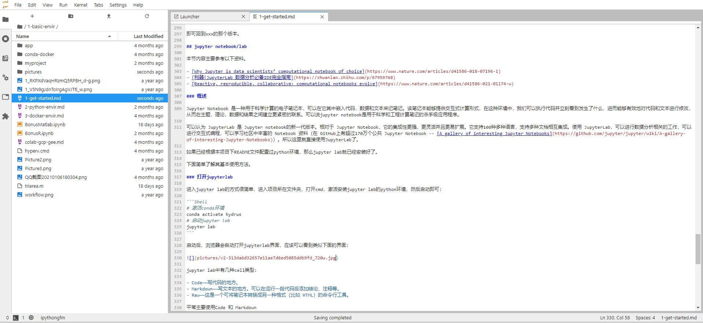
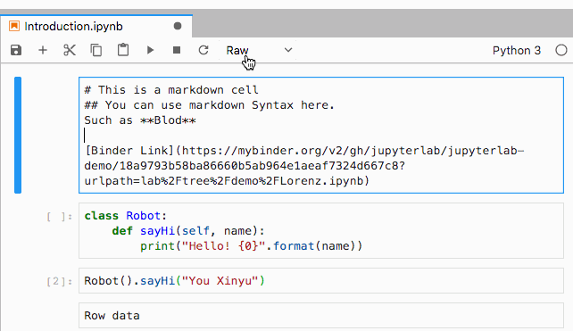

# 开始前的准备

在开始python之前先了解一些常见工具的配置和基本使用方法，包括：

- [git and github](#git-和-github)
- [jupyter lab](#jupyter-lab)

这些内容参考了：[Setup Your Earth Analytics Python, Git, Bash Environment On Your Computer](https://www.earthdatascience.org/workshops/setup-earth-analytics-python/)。这里简单记录了一些基本概念和常用操作，更详细的介绍可以参考[这里](https://github.com/waterDLut/WaterResources/blob/master/tools/writing-tool.md)。

## git 和 github

Git 是版本控制的工具，简单地说，通过它能完成对不同开发者不同时间写的代码文件（即不同版本）的高效控制与管理，类似于我们日常管理不同时间更新的word不同版本文件，只不过我们一般都是复制粘贴一个新文件，然后命名后面加上日期，以此区分，而git可以自动地帮助记录下不同版本，并随意获取查看不同版本的文件内容，当然git还有很多更强大的功能，使用中可逐渐体会。

Ubuntu或者win10下的Ubuntu里已经安装了git，不必再装了；win10下需要自行下载并安装：官网下载，安装一路默认即可。

Github 是代码共享的网站，每个人可以将自己本地电脑由git控制的代码库（repository，以下简称repo）上传到github上与他人分享，并协作开发。也就是说，github就类似于一个云端的代码库，本地的代码和它上面的代码可以保持同步的关系。使用github前，每个人需要注册一个自己的账号：直接百度搜索github，进入github官网，找到“sign up”标识，进行注册即可，注册后登陆就能进入自己的帐户。github服务器不在国内，所以防火墙对它稍微有一些影响，直接访问常看不到图片，有时候下载repo也不是特别方便，甚至无法访问，所以还是推荐科学上网，可以参考[这里](https://github.com/OuyangWenyu/elks/blob/master/common-sense/else/vpn.md)选择一些工具。

git和github之间关系：我们写代码或者文档更多地肯定还是在自己本地的电脑上操作，所以我们本地的repo版本需要本地的git软件来管理；github是一个云端代码库，我们可以利用本地的git工具将我们的本地repo上传到github上，这样别人就可以看到我们的repo（各个版本都能看到）；当然我们也能在github上下载别人的代码来使用，还可以修改别人的代码来实现协作。

关于github的使用，推荐去这里看看：https://www.zhihu.com/question/20070065/answer/79557687

本地git的使用依靠git bash命令。关于bash是什么，可以参考：[How to Access and Use Shell to Set Up a Working Directory](https://www.earthdatascience.org/workshops/setup-earth-analytics-python/introduction-to-bash-shell/)，里面讲的还是很清楚的。git bash 里面敲命令和Ubuntu系统下的指令一样的，比如cd，mkdir等常见命令。更多相关具体操作可以参考：https://www.runoob.com/git/git-basic-operations.html

其他参考资料：[Introduction to Git and GitHub for Python Developers](https://realpython.com/python-git-github-intro/)

最后记录一些常用操作备查，根据实际使用情况慢慢补充：

### 配置用户信息

第一次使用git，通常需要配置用户名和邮箱信息：

```Shell
git config --global user.name “Your Name”
git config --global user.email Youremail@example.com
```

### clone项目

进入到自己想要下载的repo页面后，点击绿色的“Code”，然后把地址copy下来，接着使用 “git clone <刚刚copy的地址>”命令，就能把代码下载到本地了；

第一个使用的git和github命令一定就是 git clone 了，以本项目为例，打开terminal，进入你想放置本项目的文件夹，执行：

```Shell
git clone https://github.com/OuyangWenyu/hydrus.git
```

### 通过SSH链接Github

上面是通过https来连接，这里补充下ssh方式，这种方式第一次配置相对麻烦一点，但是后续使用更加方便。

首先，使用如下命令创建密钥文件

```Shell
ssh-keygen -t rsa -C 你的github账号邮箱
```

输入后会提示保存key的文件以及passphrase，选择直接回车（一共三次），保存到默认位置，默认设置即可。

然后命令行上会显示处出密钥保存路径，其中私钥文件是 id_rsa，公钥文件是 id_rsa.pub

然后需要将SSH公钥添加到自己的GitHub账户。

- 复制id_rsa.pub文件中的全部内容
- 登陆到GitHub上，右上角小头像->Setting->SSH and GPG keys中，点击new SSH key，将复制的所有内容添加到其中；名称可以随便起

接下来测试链接：

```Shell
ssh -T git@github.com
```

将会看到如下提示：

The authenticity of host 'github.com (xxx.xxx.xxx.xxx)' can't be established.
RSA key fingerprint is xxxxxxxxxxxxxxxxxxxxxxxxxxxxxxxxxxxxxxx
Are you sure you want to continue connecting (yes/no)? 

输入yes，然后回车即可，这时候结果为 “ …You’ve successfully authenticated, but GitHub does not provide shell access”，则说明成功。

ssh下下载的方式和https下一样，在github中clone时选择SSH协议即可，比如下载本repo：

```Shell
git clone git@github.com:OuyangWenyu/hydrus.git
```

### 变化远程仓库地址

有时候 https连接不稳定, 想要切换 ssh, 参考[这里](https://docs.github.com/cn/github/getting-started-with-github/managing-remote-repositories#switching-remote-urls-from-https-to-ssh), 可以这么做:

```Shell
git remote set-url origin git@github.com:USERNAME/REPOSITORY.git
```

使用下面语句可以查看远程仓库是否已变:

```Shell
git remote -v
```

### add/commit/push

本地git常用的命令就是add/commit/push 三连了

``` Shell
# 修改文件后执行
git add -A
git commit -m "本次提交想要说明的东西"
git push
```

### 创建分支并推送到远程分支

参考了[git创建分支并推送到远程分支](https://blog.csdn.net/ljj_9/article/details/79386306)。

首先在master分支上，保证工作目标是干净的，也没有需要commit的：

``` Shell
git branch
git status
```

然后新建一个本地分支：

```Shell
git checkout -b  <你的分支名称>
```

比如常见的新建一个“开发”分支：

```Shell
git checkout -b dev
```

然后把新建的本地分支push到远程服务器，远程分支与本地分支同名（当然可以随意起名）：

```Shell
git push origin <你的分支名称>:<你的分支名称>
```

使用git branch -a查看所有分支，会看到remotes/origin/<你的分支名称> 这个远程分支，说明新建远程分支成功。

切换分支使用如下命令即可：

```Shell
git checkout  <你的分支名称>
```

### 拉取远程分支

参考：https://blog.csdn.net/tterminator/article/details/52225720

```Shell
# 查看所有远程分支
git branch -r
```

第一种方式：

```Shell
git checkout -b 本地分支名x origin/远程分支名x
```

使用该方式会在本地新建分支x，并自动切换到该本地分支x。

采用此种方法建立的本地分支会和远程分支建立映射关系。

方式二：

```Shell
git fetch origin 远程分支名x:本地分支名x
```

使用该方式会在本地新建分支x，但是不会自动切换到该本地分支x，需要手动checkout。

采用此种方法建立的本地分支不会和远程分支建立映射关系。

### 标签tag

使用如下命令可以查看已有标签：

```Shell
git tag
```

想要给当前已提交的版本打标签可以使用如下方式：

```Shell
git tag -a v1.4 -m "my version 1.4"
```

将刚刚创建的tag提交到github：

```Shell
git push origin v1.4
```

这样就会在github上看到tag小栏里出现新的tag了。

如果标签打错了，想要删除，执行下面语句即可：

```Shell
git tag -d v1.4 
```

想要把远程github上的对应标签也删除，执行下面语句：

```Shell
git push origin :refs/tags/v1.4 
```

### fork后同步源的新更新内容

fork了别人的repo，一段时间后，别人更新了，想要同步过来最新的内容，应该怎么做？

参考：

- [gitlab或github下fork后如何同步源的新更新内容？](https://www.zhihu.com/question/28676261)
- [Configuring a remote for a fork](https://docs.github.com/en/github/collaborating-with-issues-and-pull-requests/configuring-a-remote-for-a-fork)
- [Syncing a fork](https://docs.github.com/en/github/collaborating-with-issues-and-pull-requests/syncing-a-fork)

首先，给fork配置远程库

查看远程状态:

```Shell
git remote -v
```

确定一个将被同步给 fork 远程的上游仓库:

```Shell
git remote add upstream https://github.com/ORIGINAL_OWNER/ORIGINAL_REPOSITORY.git
```

然后再次查看远程状态，已经可以看到upstream的信息了。

从上游仓库 fetch 分支：

```Shell
git fetch upstream
```

转换到main分支

```Shell
git checkout main
```

合并远程分支：

```Shell
git merge upstream/main
# 或者
git rebase upstream/main
```

如果本地没有更改，那git就直接自动执行一个fast-forward，如果有更改，就手动调整一下有冲突的地方，然后commit即可。

最后push到自己的origin上即可。

```Shell
git push
```

### 查看历史版本

使用命令：

```Shell
git log
```

可以查看历史提交记录。

使用

```Shell
git checkout xxx（某个历史版本的哈希值，即git log下显示的每次commit对应的一串数字字母）
```

即可回到xxx的那个版本。

### 其他

最后补充一些实例资料，以供参考。

- 删除不小心提交了的包含大文件的历史commit：[How to remove/delete a large file from commit history in Git repository?](https://stackoverflow.com/questions/2100907/how-to-remove-delete-a-large-file-from-commit-history-in-git-repository)

## jupyter lab

本节内容主要参考以下资料。

- [Why Jupyter is data scientists’ computational notebook of choice](https://www.nature.com/articles/d41586-018-07196-1)
- [利器|JupyterLab 数据分析必备IDE完全指南](https://zhuanlan.zhihu.com/p/67959768)
- [Reactive, reproducible, collaborative: computational notebooks evolve](https://www.nature.com/articles/d41586-021-01174-w)

### 概述

Jupyter Notebook 是一种用于科学计算的电子笔记本，可以在它其中嵌入代码，数据和文本来记笔记。该笔记本能够提供交互式计算形式，在这种环境中，我们可以执行代码并立刻看到发生了什么，进而能够有效地对代码和文本进行修改，从而在主题，理论，数据和结果之间建立更紧密的联系。可以说jupyter notebook是用于科学和工程计算笔记的杀手级应用程序。

可以认为 JupyterLab 是 Jupyter notebook的新一代版本。相对于 Jupyter Notebook，它的集成性更强，更灵活并且更易扩展。它支持100种多种语言，支持多种文档相互集成。使用 JupyterLab，可以进行数据分析相关的工作，可以进行交互式编程，可以学习社区中丰富的 Notebook 资料（在 GitHub上有超过170万个公共 Jupyter Notebook -- [A gallery of interesting Jupyter Notebooks](https://github.com/jupyter/jupyter/wiki/A-gallery-of-interesting-Jupyter-Notebooks)）。所以这里就直接使用JupyterLab了。

如果已经根据本项目下README文件配置过python环境，那么jupyter lab就已经安装好了。

下面简单了解其基本使用方法。

### 打开jupyterlab

进入jupyter lab的方式很简单，进入项目所在文件夹，打开cmd，激活安装jupyter lab的python环境，然后启动即可：

```Shell
# 激活conda环境
conda activate hydrus
# 启动jupyter lab
jupyter lab
```

启动后，浏览器会自动打开jupyterlab界面，应该可以看到类似下面的界面：



### 基本介绍

界面上边是工具栏,和word之类的工具有些相似；左边栏是总览工具，包括文件浏览器、正在运行的 kernel 列表等；右边是主面板，也是笔记的主体部分，除了可以构建jupyter笔记外，还可以创建并编辑[markdown](https://github.com/younghz/Markdown)文件等，还能打开命令行工具。

jupyter 笔记文件中可以创建使用以下几种cell类型：

- Code——写代码和运行代码的地方。
- Markdown——写文本的地方。可以在运行一段代码后添加结论、注释等。
- Raw——这是一个可将笔记本转换成另一种格式（比如 HTML）的命令行工具。

平常主要使用Code 和 Markdown

### 一些使用小技巧

这里日常积累一些jupyter lab使用技巧

#### 快捷键

运行 cell 的快捷键 shift + command，大概会是用到最多次的一个快捷键。

选择 cell 之后，点击空白处，按下m键，代表转为markdown cell，y键代表转为code cell，同理r键代表转为row cell。



快捷键清单可以参考下图：


#### 自动补全

与大多数本地集成开发环境（IDE）相同，输入部分代码之后按 tab 键，即可自动补全。Jupyter Lab 中的自动补全功能可以通过不同的颜色和图标，显示出补全的类型。


#### Magic Code

一些特殊命令（不是内置于 Python 本身）被称为“魔术”命令。魔术命令是以百分号％为前缀的任何命令。

##### %matplotlib

最常用的魔法命令，大概就是 %matplotlib了。它用于指定 matplotlib 后端(backend)。通常使用：

```IPython
%matplotlib inline
```

代表使用 inline作为后端，直接在 Notebook 中内嵌图片，并且可以省略掉 plt.show() 这一步骤（后面第三章节介绍可视化时会详细介绍）。

##### ％timeit

％timeit 函数检查任何 Python 语句的执行时间，例如：


##### %run

使用 %run 命令，可以在Notebook中运行任意的Python文件。例如：

```IPython
%run add.py
```

还有其他一些常用命令，例如 %debug、%load_ext 和 %pwd，完整命令可以参考[这里](https://ipython.readthedocs.io/en/stable/interactive/magics.html)。

### 不只能用来记录Python代码

还可以在Jupyter Notebooks中使用R、Julia和Javascript等其他语言。比如：[Interactive Workflows for C++ with Jupyter](https://blog.jupyter.org/interactive-workflows-for-c-with-jupyter-fe9b54227d92)。如果不感兴趣，下面内容可忽略，environments.yml文件中也不涉及下面的包，如果需要需自行安装。

- 要在 Jupyter 中启用 R，需要 IRKernel，官方安装方式请参考：https://github.com/IRkernel/IRkernel 。R语言最常见的编辑器是RStudio，也可以使用 VSCode等。
- Julia，如果你是一位 Julia 用户，你也能在 Jupyter Notebooks 中使用 Julia！你可以查看这篇为 Julia 用户学习数据科学而编写的全面介绍文章，其中有一个章节就是关于如何在 Jupyter 环境中使用 Julia：https://www.analyticsvidhya.com/blog/2017/10/comprehensive-tutorial-learn-data-science-julia-from-scratch/ ；jupyterlab的julia插件安装方式可以参考[How to Add Julia to Jupyter Notebook](https://datatofish.com/add-julia-to-jupyter/)，Julia本身也有类似jupyter的Pluto工具可用；
- JavaScript， IJavascript kernel。这个 GitHub 库包含了在不同操作系统上安装这个 kernel 的各个步骤：https://github.com/n-riesco/ijavascript。注意，在使用它之前，你必需要先安装好 Node.js 和 npm。

接下来进入下一节：[1-basic-envir/2-python-envir.md](https://github.com/OuyangWenyu/hydrus/blob/master/1-basic-envir/2-python-envir.md)
