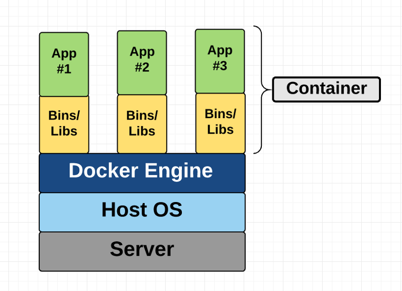
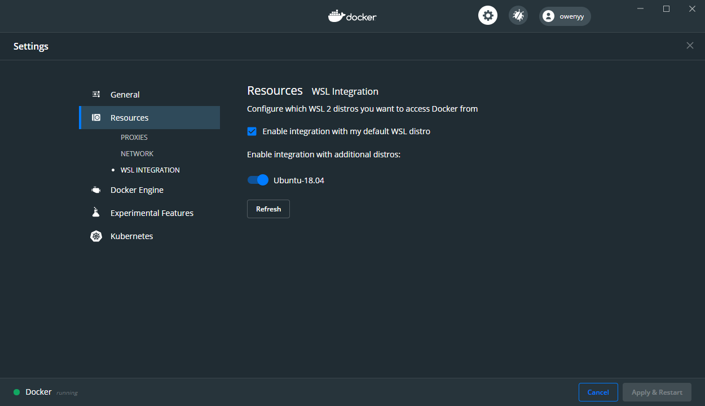

# Getting Your Python App Running with Docker

Docker的运用并不是一件容易的事情，所以不存在简单一两行代码就能解决上面说的所有事情的情况。不过如果了解docker是什么，这个过程还是相对简单的。接下来的记录主要参考了：[docker官方文档介绍](https://docs.docker.com/get-started/) 以及 [docker blog](https://www.docker.com/blog/) 下的 [python-env-series](https://www.docker.com/blog/tag/python-env-series/)系列博客。

如果需要更多资料，可以参考：

- [Docker — 从入门到实践](https://github.com/yeasy/docker_practice)
- [[译] Docker 的学习和应用](https://juejin.im/post/5d650a36f265da03c34c0bb4)
- [Docker in Action – Fitter, Happier, More Productive](https://realpython.com/docker-in-action-fitter-happier-more-productive/)
- [Python Docker Tutorials](https://realpython.com/tutorials/docker/)
- [Run Python Versions in Docker: How to Try the Latest Python Release](https://realpython.com/python-versions-docker/)

## Get started with Docker

首先，为什么需要Docker？

参考[可能是把Docker的概念讲的最清楚的一篇文章](https://juejin.im/post/5b260ec26fb9a00e8e4b031a)，[[翻譯]看Docker如何幫助你成為高效資料科學家](https://medium.com/@alicialee/%E7%BF%BB%E8%AD%AF-%E7%9C%8Bdocker%E5%A6%82%E4%BD%95%E5%B9%AB%E5%8A%A9%E4%BD%A0%E6%88%90%E7%82%BA%E9%AB%98%E6%95%88%E8%B3%87%E6%96%99%E7%A7%91%E5%AD%B8%E5%AE%B6-72f236166466)

- 一致的运行环境：Docker 的镜像提供了除内核外完整的运行时环境，确保了应用运行环境一致性，从而不会再出现 “这段代码在我机器上没问题啊” 这类问题 
- 更快速的启动时间：可以做到秒级、甚至毫秒级的启动时间。大大的节约了开发、测试、部署的时间
- 隔离性：避免公用的服务器，资源会容易受到其他用户的影响
- 弹性伸缩，快速扩展：善于处理集中爆发的服务器使用压力
- 迁移方便：可以很轻易的将在一个平台上运行的应用，迁移到另一个平台上，而不用担心运行环境的变化导致应用无法正常运行的情况
- 持续交付和部署：使用 Docker 可以通过定制应用镜像来实现持续集成、持续交付、部署

对于python的开发或者数据分析者：

- Reproducibility：能够重现你的研究工作是非常重要的，比如当你想把python建好的模型分享給你的同事时，只是給一份python套件清单或是几个txt是不够的，如果將你所用的开发环境封装起来，包含了你所使用的操作系统，编译器, drivers, 环境设定, 和相关的资料档案等一切能顺利运行程序的条件，交給你同事，让他能够快速重建一套相同的环境，是极好的。
- Protability：当作业环境频繁改动时，可能会影响研究成果，比如刚开始很可能只在自己的PC上，但后来可能会转移到好的机器上，但这个转移可能会很麻烦，这时候Docker就能夠轻松地将研究资料, 函数库等打包并搬移到新环境。
- 強化你的专业技能：有了Docker你就可以很放心的將你的研究成果或程序交給其他人來运行。

实现这些好处在Docker之前是困难的，管理依赖，保持更新，安装调试代码 都是 很繁琐的工作，特别是当系统需要很多服务的时候，就更困难了，也十分容易出错，而我们肯定希望我们的应用很稳定。有了docker，这些都变得简单，docker把所有代码，依赖的程序和配置都合在一起（即镜像image），一次就能搞定所有。

围绕Docker的事情就是 build/ship/run images。只要能将所有的东西打包到image就是构建，之后就可以很方便的ship镜像，运行镜像了。

- Docker镜像：docker的镜像是一个模子，用它来生成一样的多个容器。镜像包含 Dockerfile，库，以及需要运行的应用代码，所有这些绑定在一起组成镜像。
- Dockfile：是一个包含了 Docker 如何构建镜像的指令的文件。
    - Dockerfile 会指向一个可用于构建初始镜像层的基础镜像（比如使用广泛的官方基础镜像 python、ubuntu等）。
    - 其他附加层将会根据 Dockerfile 中的指令，添加在基础镜像层的上面。例如，机器学习应用的 Dockerfile 将会通知 Docker 在中间层中添加 NumPy、Pandas 和 Scikit-learn。
    - 最后，一个很薄（体积小）并且可写的层将会根据 Dockerfile 的代码添加在所有层的上方。
- Docker Container：Docker 镜像加上命令 docker run image_name 将会从这个镜像中创建一个容器，并启动它。
- Container 注册处：如果你想让其他人也可以使用你的镜像生成容器，你需要将镜像发送给容器注册处。Docker Hub 是最大的、也是人们默认的注册处。

总结下，像做一款披萨一样。

- 配方就是 Dockerfile。它告诉我们如何操作才能做好这款披萨。
- 材料就是 Docker 的层。现在你已经有了披萨的面坯，酱料以及芝士了。
- 将配方和原料的组合想象为一个一体化的披萨制作工具包。这就是 Docker 镜像。

配方（Dockerfile）告诉了我们操作步骤。如下：

- 披萨面坯是不能改的，就好比是基础的 ubuntu 父级镜像。它是底层，并且会最先被构建。
- 然后还需要添加一些芝士。披萨的第二层就好比安装外部库 —— 例如 NumPy。
- 然后你还可以撒上一些罗勒。罗勒就好比你写在文件里的代码，用来运行你的应用。

接下来可以烤了：

- 用来烤披萨的烤箱就好比是 Docker 平台。你将烤箱搬到你的家里，这样就可以用它来烹饪了。相似的，你把 Docker 安装到你的电脑里，这样就可以操作容器。
- 你通过旋转旋钮来让烤箱开始工作。docker run image_name 指令就像是你的旋钮 —— 它可以创建并让容器开始工作。
- 做好的披萨就好比是一个 Docker 容器。
- 享用披萨就好比是使用你的应用。

总之，Docker 能帮助我们真实复现生产环境，是infrastructure的版本控制，构建一次到处运行。

p.s.：最后补充一点虚拟机的概念。虚拟机是 Docker 容器的前身。虚拟机也会分离应用和它的依赖。但是，Docker 容器需要的资源更少，更轻也更快，因此它要比虚拟机更加先进。根据[A Beginner-Friendly Introduction to Containers, VMs and Docker](https://www.freecodecamp.org/news/a-beginner-friendly-introduction-to-containers-vms-and-docker-79a9e3e119b/)，简单概括下虚拟机和容器的区别。

虚拟机和容器在目标上是相似的，都是为了将应用和其依赖分离，以便于可以在任意地方运行于自包含单元中。他们都取消了对物理硬件的要求，更节省计算资源。两者的不同主要是架构方法不一样。

虚拟机本质上是真实计算机的仿真，它像真实计算机一样执行程序。vm在使用hypervisor的物理机器上运行。hypervisor是是一段vm在其上运行的软件、固件或硬件。hypervisors是运行在物理机（主机）上的。主机提供包括RAM和CPU的虚拟机。RAM和CPU资源在虚拟机间可以分配。运行在主机上的VM也称为guest machine。guest machine包括应用和需要运行应用的东西，比如system binaries and libraries。还有它还携带了自己的整个虚拟化硬件堆栈，包括虚拟化的网络适配器、存储和CPU，这意味着它还拥有自己完整的guest operating system。总之形式如下：


而容器不像VM那样能提供硬件的虚拟化，容器提供的是操作系统级别的虚拟化。容器看起来就像一个VM。例如，它们有专用的处理空间，可以作为根用户执行命令，有专用的网络接口和IP地址，允许自定义路由和iptable规则，可以挂载文件系统，等等。其最大的区别是**容器之间共享主机系统的内核**。容器只打包用户空间，而不像VM那样打包内核或虚拟硬件。每个容器都有自己的独立用户空间，允许多个容器在一台主机上运行。



简单了解下足够了，暂时没必要更深入的区别分析。

下面进入实操阶段，通过示例来学习docker配置并运行python环境。

## 安装Docker

接下来看看如何将Docker加入到python开发工作流中，以用它来部署应用到本地或云端。

第一步自然是安装Docker。因为我的windows是home版的，所以参考官网这里：[Install Docker Desktop on Windows Home](https://docs.docker.com/docker-for-windows/install-windows-home/)。

其他参考资料：

- [Setting up your computer](https://docker-curriculum.com/#setting-up-your-computer)
- [Docker — Beginner’s Guide — Part 1: Images & Containers](https://medium.com/codingthesmartway-com-blog/docker-beginners-guide-part-1-images-containers-6f3507fffc98)。

Windows 家庭版下，docker需要使用WSL2 backend安装，即安装的是Docker Desktop的Linux container development版本。

要求Windows下Ubuntu安装，可以参考[这里](https://github.com/OuyangWenyu/elks)。

另外，要求支持二级地址转换，我也不知道啥意思，反正在这个网站查一下是否支持即可：https://archive.codeplex.com/?p=slatstatuscheck 。我的是支持的。

还需要至少4GB 内存，这个我也是满足的。

此外，Hyper-V要有，VIRTUALIZATION 要启动起来，这部分可以参考：https://docs.docker.com/docker-for-windows/troubleshoot/#virtualization-must-be-enabled 。首先要查自己的系统是否已满足要求，命令行输入：

```CMD
systeminfo
```

结果是：

```cmd
Hyper-V 要求:     虚拟机监视器模式扩展: 是
                  固件中已启用虚拟化: 否
                  二级地址转换: 是
                  数据执行保护可用: 是
```

所以先在固件中启用虚拟化。首先，确认下电脑CPU是否支持虚拟化，一般都支持，使用 securable 小软件可以查看。下载securable软件：https://www.grc.com/securable.htm

点击运行，即可看到自己CPU是否支持虚拟化了。

接下来就在BIOS设置开启虚拟化。这步需要重启电脑，进入BIOS模式，根据自己的电脑型号百度查询进入BIOS的方式，我的是在重启开始的时候按F2。进入后，找到Virtualization，我的是在 security下面，选择Virtualization Technology，按下enter键，选择enable即可。然后退出BIOS模式，ESC->F10->选择yes，按enter 即可。这时候电脑就会重启，再次执行上述命令即可发现固件中已启用虚拟化。

然后还需要添加Hyper-V，根据 https://zhuanlan.zhihu.com/p/74906615 介绍，新建记事本，复制以下命令，后缀改为 .bat 或 .cmd（本文件夹下已经有该文件了，可以直接使用），以管理员身份运行

```cmd
pushd "%~dp0"

dir /b %SystemRoot%\servicing\Packages\*Hyper-V*.mum >hyper-v.txt

for /f %%i in ('findstr /i . hyper-v.txt 2^>nul') do dism /online /norestart /add-package:"%SystemRoot%\servicing\Packages\%%i"

del hyper-v.txt

Dism /online /enable-feature /featurename:Microsoft-Hyper-V-All /LimitAccess /ALL
```

命令处理完成后，输入 "Y" 确认重启，进行配置更新。

这样添加 Hyper-V 就完成了。进入系统“控制面板——程序——启用或关闭Windows功能”，即可看到自己的Hyper-V前面是有对号的。

接着，Download and install [the Linux kernel update package](https://docs.microsoft.com/windows/wsl/wsl2-kernel)，进入这个链接，执行第四步即可。

这样准备工作就完成了，下面可以安装docker destop了。下载Docker Desktop Installer.exe ，地址：https://hub.docker.com/editions/community/docker-ce-desktop-windows/

下载后直接点击安装即可，注意勾选 Enable WSL 2 Features 项，然后等待安装完成即可，完成后同意重启，重启后即可看到 docker desktop已经自动启动了。

接下来是Linux下的安装，Linux下没有 Docker Desktop，直接安装 Docker即可。Linux有不同的版本，我的Linux是Ubuntu，所以主要参考：https://docs.docker.com/engine/install/ubuntu/

先检查系统版本（看上面的链接网页内容，我的是Ubuntu 18.04，符合要求），然后 Uninstall old versions

```Shell
sudo apt-get remove docker docker-engine docker.io containerd runc
```

运行结果显示 这些包都没有安装，那么就可以继续接下来的安装了。如果已安装且需要完全卸载Docker，可以参考：https://docs.docker.com/engine/install/ubuntu/#uninstall-docker-engine

使用推荐的安装方式--Install using the repository，先设置REPOSITORY，逐一执行下列语句即可。

```Shell
sudo apt-get update

sudo apt-get install \
    apt-transport-https \
    ca-certificates \
    curl \
    gnupg-agent \
    software-properties-common
    
curl -fsSL https://download.docker.com/linux/ubuntu/gpg | sudo apt-key add -

sudo apt-key fingerprint 0EBFCD88

sudo add-apt-repository \
   "deb [arch=amd64] https://download.docker.com/linux/ubuntu \
   $(lsb_release -cs) \
   stable"
```

执行上面这句的时候，代码里需要带上$。

然后可以安装docker-ce了。

```Shell
sudo apt-get update
sudo apt-get install docker-ce docker-ce-cli containerd.io
```

接下来就可以看看自己是否安装成功了。

```Shell
sudo docker run hello-world
```

Mac操作系统可以参考这个：[Should You Install Docker with the Docker Toolbox or Docker for Mac / Windows?](https://nickjanetakis.com/blog/should-you-use-the-docker-toolbox-or-docker-for-mac-windows)，这里就不记录了。

另外，根据[Docker(四)：Docker 三剑客之 Docker Compose](http://www.ityouknow.com/docker/2018/03/22/docker-compose.html)一文的介绍，如果需要构建多容器的应用，还需要使用docker compose来帮助构建，这里最终目的只是构建并运行本项目，所以就暂略这部分，后面用到了再补充。

## 使用 docker build -> run -> ship 本项目

如前所述，docker 的使用就是 build - ship - run images，所以下面就从如何构建镜像开始，而构建的关键就是写 dockerfile，因此先关注如何使用Dockerfiles构建自己的镜像。

接下来的操作都是在windows home 下安装dockerhub后执行的，但是到挂载本地文件那一步会发现容器内读不到本地的文件夹，个人猜测可能是windows home下用/mnt 文件夹的方式可能不太行，不过不确定，所以还是以 Linux下的操作为主了，因此接下来在windows home下的尝试会用分割线标出，仅供个人后面排查问题留个记录，感兴趣的也可以看看。

另外，如果是 windows 专业版，好像可以直接在dockerhub内配置，就比较方便了，因为我没有用它，所以这里就不记录了。

TODO:在Ubuntu系统下的操作

===================================================================================windows home 版分割线===========================================================================================================================

在构建本项目之前，先从一些[简单的案例](https://www.docker.com/blog/containerized-python-development-part-1/)开始，看看如何设置一个简单的python环境。

和前面2-python-envir.md 中介绍的一样，要运行一个python程序，要先安装需要的包，我们推荐的是conda安装方法，并构建了environment.yml文件，所以使用dockerfile时，我们要把这部分内容包含进来。这里先用一个 pip 的例子，把安装包对应的requirements.txt文件包含在dockerfile中，后面再给出本项目的例子。

相关文件都保存在本文件夹下的app文件夹中了。dockerfile内容如下：

```Dockerfile
# set base image (host OS)
FROM python:3.8

# set the working directory in the container
WORKDIR /code

# copy the dependencies file to the working directory
COPY requirements.txt .

# install dependencies
RUN pip install -r requirements.txt

# copy the content of the local src directory to the working directory
COPY src/ .

# command to run on container start
CMD [ "python", "./server.py" ]
```

对于Dockerfile中的每条指令或命令，Docker构建器都会生成一个image层并将其堆叠在先前的层上。因此，该过程产生的Docker image只是一个不同层的只读栈。

我们还可以在build命令的输出中观察到各步骤执行的Dockerfile指令。

打开windows终端，进入dockerfile所在文件夹，即本文件夹下的app文件夹，运行下列代码：

```Shell
docker build -t myimage .
```

这时候就能看到 dockerhub下已经有了这个刚刚生成的镜像了。

如果想要持续更新里面的内容，则需要重新build，但是我们肯定不想完全从头构建，那么这会比较慢，docker默认采用了 the builder cache mechanism 来完成首次构建之后的构建。

Dockerfile 的指令是按照指定的顺序依次执行的，对于每条指令，builder 都会首先检查镜像的缓存来复用。当检测到有层发生变化的时候，该层以及之后的所有层会被重新构建。所以为了更好地使用docker的这一特性，通常要将经常变化的部分往后放，这样就能最大程度地节省时间了。比如上面的dockerfile写法中，代码是比依赖程序包更常变的，所以将代码写到了最后。可以尝试修改一点代码，比如增加一个print("hello world")，然后重新构建：

```Shell
docker build -t myimage .
```

可以发现，构建速度是很快的。

构建完成之后，尝试运行。将image run成container。首先，查看现在有哪些image

```Shell
docker images
```

如果想要删除某些 images，可以使用如下语句（删除之前确保没有对应的容器在运行）：

```Shell
docker image rm [image的id]
```

如果提示了无法删除，有容器在运行，则执行下列语句将容器删除：

```Shell
docker container rm [提示的容器id]
```

然后就可以删除镜像了。当然这些操作在dockerhub中进行会更容易。

下面看看我们如何构建本项目的docker image 并 发布出去。

如一开始说set up环境的时候提到的那样，要运行起程序，我们需要以下几个关键环节：

- 操作系统：因为大部分例子以及docker image都是基于ubuntu的，所以这里也选择Ubuntu
- miniconda3
- 用conda 和 本项目的 environment.yml 生成 python 虚拟环境
- 激活生成的虚拟环境
- 运行的时候得能使用 jupyter，在主机上能通过浏览器访问到其中的内容
- 最后是持续的更新

所以接下来就逐个解决，看看 docker 的 build/run/ship 是如何在上面几步骤里面体现的。参考资料：[veggiemonk/awesome-docker](https://github.com/veggiemonk/awesome-docker)

在 awesome-docker 中找到：[Production-ready Docker packaging for Python developers](https://pythonspeed.com/docker/)

里面有非常丰富的关于使用docker创建python环境及程序运行的blog。

也先从一个简单的例子开始，主要参考了：[Activating a Conda environment in your Dockerfile](https://pythonspeed.com/articles/activate-conda-dockerfile/)

docker环境中激活conda有一点点麻烦。假如dockerfile这样写：

```Dockerfile
FROM continuumio/miniconda3

WORKDIR /app

# Create the environment:
COPY environment.yml .
RUN conda env create -f environment.yml

# Activate the environment, and make sure it's activated:
RUN conda activate myenv
RUN echo "Make sure flask is installed:"
RUN python -c "import flask"

# The code to run when container is started:
COPY run.py .
ENTRYPOINT ["python", "run.py"]
```

那么运行到 conda activate myenv 时，是会报错的，“CommandNotFoundError: Your shell has not been properly configured to use 'conda activate'.”。因为 容器内在执行：/bin/sh -c "conda activate env"

关于 /bin/sh 啥意思可以参考：[About /bin/sh](http://etutorials.org/Linux+systems/how+linux+works/Chapter+1+The+Basics/1.1+About+bin+sh/)，简而言之，就是默认的代码是用sh执行，但是conda要执行，需要bash环境。

所以这是不会执行 conda activate 命令的，需要加上：RUN conda init bash

```dockerfile
FROM continuumio/miniconda3

WORKDIR /app

# Make RUN commands use `bash --login`:
SHELL ["/bin/bash", "--login", "-c"]

# Create the environment:
COPY environment.yml .
RUN conda env create -f environment.yml

# Initialize conda in bash config fiiles:
RUN conda init bash

# Activate the environment, and make sure it's activated:
RUN conda activate myenv
RUN echo "Make sure flask is installed:"
RUN python -c "import flask"

# The code to run when container is started:
COPY run.py .
ENTRYPOINT ["python", "run.py"]
```

不过由于dockerfile中每个run都是一个单独的bash，后面新的run都是新的shell session了。RUN python -c "import flask" 这步就会报错：“ModuleNotFoundError: No module named 'flask'”

因此，要把conda activate命令佳到用户上：RUN echo "conda activate myenv" > ~/.bashrc

```Dockerfile
FROM continuumio/miniconda3

WORKDIR /app

# Make RUN commands use `bash --login`:
SHELL ["/bin/bash", "--login", "-c"]

# Create the environment:
COPY environment.yml .
RUN conda env create -f environment.yml

# Initialize conda in bash config fiiles:
RUN conda init bash

# Activate the environment, and make sure it's activated:
RUN echo "conda activate myenv" > ~/.bashrc
RUN echo "Make sure flask is installed:"
RUN python -c "import flask"

# The code to run when container is started:
COPY run.py .
ENTRYPOINT ["python", "run.py"]
```

到这，build已经可以成功了，但是最后一步，在运行的时候还是会报错。因为还需要明确指定是在conda 激活的环境下运行的：ENTRYPOINT ["conda", "run", "-n", "myenv", "python", "run.py"]

```Dockerfile
FROM continuumio/miniconda3

WORKDIR /app

# Create the environment:
COPY environment.yml .
RUN conda env create -f environment.yml

# Make RUN commands use the new environment:
SHELL ["conda", "run", "-n", "myenv", "/bin/bash", "-c"]

# Make sure the environment is activated:
RUN echo "Make sure flask is installed:"
RUN python -c "import flask"

# The code to run when container is started:
COPY run.py .
ENTRYPOINT ["conda", "run", "-n", "myenv", "python", "run.py"]
```

然后接下来 build 和 run：

```Dockerfile
docker build -t condatest .
```

成功 build 之后， 执行run：

```Dockerfile
docker run condatest
```

接下来就看看如果 build 和 run 本项目。

首先，需要写dockerfile。根据前面的例子，可以尝试写dockerfile 如下：

```Dockerfile
FROM continuumio/miniconda3

WORKDIR /hydrus

# Create the environment:
COPY environment.yml .
RUN conda env create -f environment.yml

# Make RUN commands use the new environment:
SHELL ["conda", "run", "-n", "hydrus", "/bin/bash", "-c"]
```

到这一步，就能实现基本运行环境的构建了。但是还有问题就是如何在运行的时候得能使用 jupyter，在主机上能通过浏览器访问到其中的内容。这就需要添加下列内容。


```Dockerfile
FROM continuumio/miniconda3

WORKDIR /hydrus

# Create the environment:
COPY environment.yml .
RUN conda env create -f environment.yml

# Make RUN commands use the new environment:
SHELL ["conda", "run", "-n", "hydrus", "/bin/bash", "-c"]

# Expose Jupyter port & cmd
EXPOSE 8888
CMD jupyter lab --ip=* --port=8888 --no-browser --notebook-dir=/hydrus --allow-root
```

运行下列代码：

```Dockerfile
docker build -t hydrustest .
docker run hydrustest
```

这样就能运行起jupyter了，但是如果直接使用 localhost:8888，发现弹出来的页面要输入密码，或者token，而目前看不到token，根据页面上的提示，需要到容器中运行 jupyter server list 查看，在windows下dockerhub里，点击运行的容器，选择CLI工具，在打开的容器命令行里执行下列语句就能看到启动的jupyter的token。也可以参考这个的做法：https://forums.docker.com/t/how-to-get-token-and-password-to-work-for-jupyter-datascience-notebook/83649

```Shell
$ bash
(base) root@2e15b98dd04c:/hydrus$ conda activate hydrus
(hydrus) root@2e15b98dd04c:/hydrus$ jupyter server list
Currently running servers:
http://localhost:8888/?token=c048d379be3d0beecf234604bb2c0f9d4e7d1c3b7d597a09 :: /hydrus
(hydrus) root@2e15b98dd04c:/hydrus#$
```

如上所示， http://localhost:8888/?token=c048d379be3d0beecf234604bb2c0f9d4e7d1c3b7d597a09 即可以在 本地 浏览器中打开的地址。

但是会发现，打开的jupyter没有文件，因为我们还没有把本项目的文件放入容器中，那么盲猜这里有不一样的策略，一种是把运行的文件放到docker容器里；一种是把docker仅仅当作一个环境，文件还是用本机的或者其他地方的。

如果是采用第一种，需要使用COPY指令，但是把所有文件都copy到容器中还是不方便，尤其是文件较多较大的时候，并且在容器中的文件夹和文件应该是不能跟着本地改的，所以个人觉得还是第二种更方便一些，所以查询下相关的资料：https://towardsdatascience.com/a-short-guide-to-using-docker-for-your-data-science-environment-912617b3603e

需要将本地文件夹挂载到container下，有点像一个外接硬盘挂载到linux系统下。具体操作参考了[A Short Guide to Using Docker for Your Data Science Environment](https://towardsdatascience.com/a-short-guide-to-using-docker-for-your-data-science-environment-912617b3603e), [Docker，救你于「深度学习环境配置」的苦海](https://zhuanlan.zhihu.com/p/64493662)还有[How to Run Jupyter Notebook on Docker](https://towardsdatascience.com/how-to-run-jupyter-notebook-on-docker-7c9748ed209f#0ba2)，直接在 docker run 的时候执行下述语句。注意，因为我是windows home版，所以挂载的本地硬盘还是用 /mnt/c/Projects/hydrus 了，如果直接用 C:\Projects\hydrus （这是本项目在我本地windows上的实际位置），虽然也run起来了，但是dockerhub会提示我挂载了windows文件夹是有问题的。

```Shell
docker run -p 8888:8888 -v /mnt/c/Projects/hydrus:/home/hydrus -t hydrustest
```

但是问题是在本地电脑上启动jupyter后，还是没有看到挂载的本地硬盘。猜测可能是因为dockerfile中先运行了 jupyter了，再挂载可能看不到了，所以不在dockerfile中写CMD，删除最后一行，然后重新build，之后再run的时候挂载硬盘，然后再**在容器里面**开启jupyter。

```Shell
jupyter lab --no-browser --ip=0.0.0.0 --allow-root --notebook-dir=/hydrus
```

还是不行，是不是因为hydrus已经有了，所以硬盘挂载出问题了，所以尝试换一个，删除刚才的容器，然后在主机执行下面语句：

```Shell
docker run -p 8888:8888 -v /mnt/c/Projects/hydrus:/hydrus/test -t hydrustest
```

再进入容器查看，发现还是没有。查了下，看到了：[Docker volumes on Windows WSL2](https://stackoverflow.com/questions/63552052/docker-volumes-on-windows-wsl2)，发现可能是自己的 WSL2 没有用对，所以导致文件夹没有挂载上，所以根据docker 官方文档：https://docs.docker.com/docker-for-windows/wsl/#best-practices  重新把其中提到的 “Ensure the distribution runs in WSL 2 mode” 等内容执行下，把 安装的 Ubuntu 也和 docker 整合下（如下图所示），然后再把之前弄得镜像和容器都删除，重新执行一遍再看看能不能挂载上。



不过试完发现还是没有，所以暂时放弃了。可能需要在linux下试试再看了，也可能需要docker compose了。

===================================================================================windows home 版分割线===========================================================================================================================

关于更多的构建自己的dockerfile的方法可以参考[Python image description on Docker Hub](https://hub.docker.com/_/python/#how-to-use-this-image)

dockerfile 写法可以参考：[docker_practice](https://github.com/yeasy/docker_practice)。

更多案例可以参考：[The Full Stack Data Scientist Part 2: A Practical Introduction to Docker](https://medium.com/applied-data-science/the-full-stack-data-scientist-part-2-a-practical-introduction-to-docker-1ea932c89b57)

最后再补充一些docker的基本概念--镜像和容器及定制镜像等，如果有需要可以看看。

## 概念补充

操作系统分为内核和用户空间，对于 Linux 而言，内核启动后，会挂载 root 文件系统为其提供用户空间支持。而 Docker 镜像（Image），就相当于是一个 root 文件系统。比如官方镜像 ubuntu:18.04 就包含了完整的一套 Ubuntu 18.04 最小系统的 root 文件系统。

Docker 镜像是一个特殊的文件系统，除了提供容器运行时所需的程序、库、资源、配置等文件外，还包含了一些为运行时准备的一些配置参数（如匿名卷、环境变量、用户等）。镜像不包含任何动态数据，其内容在构建之后也不会被改变。

因为镜像包含操作系统完整的 root 文件系统，其体积往往是庞大的，因此在 Docker 设计时，就充分利用 Union FS 的技术（不用在意具体这个技术是啥），将其设计为**分层存储**的架构。所以严格来说，镜像并非是像一个 ISO 那样的打包文件，镜像只是一个虚拟的概念，其实际体现并非由一个文件组成，而是**由一组文件系统组成**，或者说，**由多层文件系统联合组成**。

镜像构建时，会**一层层构建，前一层是后一层的基础**。每一层构建完就不会再发生改变，后一层上的任何改变只发生在自己这一层。比如，删除前一层文件的操作，实际不是真的删除前一层的文件，而是仅在当前层标记为该文件已删除。在最终容器运行的时候，虽然不会看到这个文件，但是实际上该文件会一直跟随镜像。因此，在构建镜像的时候，需要额外小心，每一层尽量只包含该层需要添加的东西，任何额外的东西应该在该层构建结束前清理掉。

分层存储的特征还使得镜像的复用、定制变的更为容易。甚至**可以用之前构建好的镜像作为基础层，然后进一步添加新的层，以定制自己所需的内容，构建新的镜像**。

镜像是静态的定义，容器是镜像运行时的实体。容器可以被创建、启动、停止、删除、暂停等。**容器的实质是进程**，但与直接在宿主执行的进程不同，**容器进程运行于属于自己的独立的命名空间**。因此容器可以拥有自己的 root 文件系统、自己的网络配置、自己的进程空间，甚至自己的用户 ID 空间。容器内的进程是运行在一个隔离的环境里，使用起来，就好像是在一个独立于宿主的系统下操作一样。

镜像使用的是分层存储，容器也是如此。每一个容器运行时，是**以镜像为基础层**，**在其上创建一个当前容器的存储层**，我们可以称这个为容器运行时读写而准备的存储层为 容器存储层。

按照 Docker 最佳实践的要求，**容器不应该向其存储层内写入任何数据**，容器存储层要保持无状态化。**所有的文件写入操作，都应该使用 数据卷（Volume）、或者绑定宿主目录**，在这些位置的读写会跳过容器存储层，直接对宿主（或网络存储）发生读写，其性能和稳定性更高。

**数据卷的生存周期独立于容器**，容器消亡，数据卷不会消亡。因此，使用数据卷后，容器删除或者重新运行之后，数据却不会丢失。

每次执行docker run的时候都会指定哪个镜像作为容器运行的基础，所以如果来自于docker hub的镜像不满足需求，那就需要定制镜像了。

所谓定制镜像，那一定是**以一个镜像为基础，在其上进行定制**。基础镜像是必须指定的。而 FROM 就是指定 基础镜像，因此一个 Dockerfile 中 **FROM 是必备的指令，并且必须是第一条指令**。

在 Docker Hub 上有非常多的高质量的官方镜像，有可以直接拿来使用的服务类的镜像，如 nginx、redis、mongo、mysql、httpd、php、tomcat 等；也有一些方便开发、构建、运行各种语言应用的镜像，如 node、openjdk、python、ruby、golang 等。可以在其中寻找一个最符合我们最终目标的镜像为基础镜像进行定制。

如果没有找到对应服务的镜像，官方镜像中还提供了一些更为基础的操作系统镜像，如 ubuntu、debian、centos、fedora、alpine 等，这些操作系统的软件库为我们提供了更广阔的扩展空间。

除了选择现有镜像为基础镜像外，Docker 还存在一个特殊的镜像，名为 scratch。这个镜像是虚拟的概念，并不实际存在，它表示一个空白的镜像。

更多关于 dockerfile 写法 以及使用的教程，这里就不贴了，后面有用到再补充。
