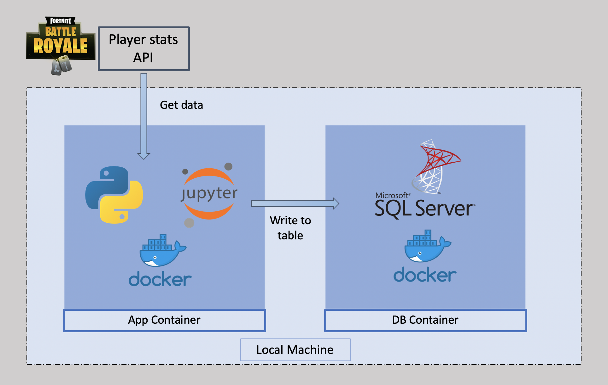
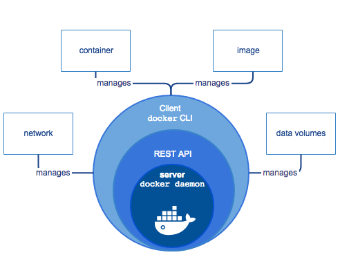

# Getting Your Python App Running with Docker

Docker的运用并不是一件容易的事情，所以不存在简单一两行代码就能解决上面说的所有事情的情况。不过如果了解docker是什么，这个过程还是相对简单的。接下来的记录主要参考了：[docker官方文档介绍](https://docs.docker.com/get-started/)

如果需要更多资料，可以参考：

- [Docker — 从入门到实践](https://github.com/yeasy/docker_practice)
- [[译] Docker 的学习和应用](https://juejin.im/post/5d650a36f265da03c34c0bb4)
- [Docker in Action – Fitter, Happier, More Productive](https://realpython.com/docker-in-action-fitter-happier-more-productive/)
- [Python Docker Tutorials](https://realpython.com/tutorials/docker/)
- [Run Python Versions in Docker: How to Try the Latest Python Release](https://realpython.com/python-versions-docker/)

## Get started with Docker

首先，为什么需要Docker？

参考[可能是把Docker的概念讲的最清楚的一篇文章](https://juejin.im/post/5b260ec26fb9a00e8e4b031a)，[[翻譯]看Docker如何幫助你成為高效資料科學家](https://medium.com/@alicialee/%E7%BF%BB%E8%AD%AF-%E7%9C%8Bdocker%E5%A6%82%E4%BD%95%E5%B9%AB%E5%8A%A9%E4%BD%A0%E6%88%90%E7%82%BA%E9%AB%98%E6%95%88%E8%B3%87%E6%96%99%E7%A7%91%E5%AD%B8%E5%AE%B6-72f236166466)

- 一致的运行环境：Docker 的镜像提供了除内核外完整的运行时环境，确保了应用运行环境一致性，从而不会再出现 “这段代码在我机器上没问题啊” 这类问题 
- 更快速的启动时间：可以做到秒级、甚至毫秒级的启动时间。大大的节约了开发、测试、部署的时间
- 隔离性：避免公用的服务器，资源会容易受到其他用户的影响
- 弹性伸缩，快速扩展：善于处理集中爆发的服务器使用压力
- 迁移方便：可以很轻易的将在一个平台上运行的应用，迁移到另一个平台上，而不用担心运行环境的变化导致应用无法正常运行的情况
- 持续交付和部署：使用 Docker 可以通过定制应用镜像来实现持续集成、持续交付、部署

对于python的开发或者数据分析者：

- Reproducibility：能够重现你的研究工作是非常重要的，比如当你想把python建好的模型分享給你的同事时，只是給一份python套件清单或是几个txt是不够的，如果將你所用的开发环境封装起来，包含了你所使用的操作系统，编译器, drivers, 环境设定, 和相关的资料档案等一切能顺利运行程序的条件，交給你同事，让他能够快速重建一套相同的环境，是极好的。
- Protability：当作业环境频繁改动时，可能会影响研究成果，比如刚开始很可能只在自己的PC上，但后来可能会转移到好的机器上，但这个转移可能会很麻烦，这时候Docker就能夠轻松地将研究资料, 函数库等打包并搬移到新环境。
- 強化你的专业技能：有了Docker你就可以很放心的將你的研究成果或程序交給其他人來运行。

实现这些好处在Docker之前是困难的，管理依赖，保持更新，安装调试代码 都是 很繁琐的工作，特别是当系统需要很多服务的时候，就更困难了，也十分容易出错，而我们肯定希望我们的应用很稳定。有了docker，这些都变得简单，docker把所有代码，依赖的程序和配置都合在一起（即镜像image），一次就能搞定所有。

围绕Docker的事情就是 build/ship/run images。只要能将所有的东西打包到image就是构建，之后就可以很方便的ship镜像，运行镜像了。

- Docker镜像：docker的镜像是一个模子，用它来生成一样的多个容器。镜像包含 Dockerfile，库，以及需要运行的应用代码，所有这些绑定在一起组成镜像。
- Dockfile：是一个包含了 Docker 如何构建镜像的指令的文件。
    - Dockerfile 会指向一个可用于构建初始镜像层的基础镜像（比如使用广泛的官方基础镜像 python、ubuntu等）。
    - 其他附加层将会根据 Dockerfile 中的指令，添加在基础镜像层的上面。例如，机器学习应用的 Dockerfile 将会通知 Docker 在中间层中添加 NumPy、Pandas 和 Scikit-learn。
    - 最后，一个很薄（体积小）并且可写的层将会根据 Dockerfile 的代码添加在所有层的上方。
- Docker Container：Docker 镜像加上命令 docker run image_name 将会从这个镜像中创建一个容器，并启动它。
- Container 注册处：如果你想让其他人也可以使用你的镜像生成容器，你需要将镜像发送给容器注册处。Docker Hub 是最大的、也是人们默认的注册处。

总结下，像做一款披萨一样。

- 配方就是 Dockerfile。它告诉我们如何操作才能做好这款披萨。
- 材料就是 Docker 的层。现在你已经有了披萨的面坯，酱料以及芝士了。
- 将配方和原料的组合想象为一个一体化的披萨制作工具包。这就是 Docker 镜像。

配方（Dockerfile）告诉了我们操作步骤。如下：

- 披萨面坯是不能改的，就好比是基础的 ubuntu 父级镜像。它是底层，并且会最先被构建。
- 然后还需要添加一些芝士。披萨的第二层就好比安装外部库 —— 例如 NumPy。
- 然后你还可以撒上一些罗勒。罗勒就好比你写在文件里的代码，用来运行你的应用。

接下来可以烤了：

- 用来烤披萨的烤箱就好比是 Docker 平台。你将烤箱搬到你的家里，这样就可以用它来烹饪了。相似的，你把 Docker 安装到你的电脑里，这样就可以操作容器。
- 你通过旋转旋钮来让烤箱开始工作。docker run image_name 指令就像是你的旋钮 —— 它可以创建并让容器开始工作。
- 做好的披萨就好比是一个 Docker 容器。
- 享用披萨就好比是使用你的应用。

总之，Docker 能帮助我们真实复现生产环境，是infrastructure的版本控制，构建一次到处运行。

p.s.：最后补充一点虚拟机的概念。虚拟机是 Docker 容器的前身。虚拟机也会分离应用和它的依赖。但是，Docker 容器需要的资源更少，更轻也更快，因此它要比虚拟机更加先进。根据[A Beginner-Friendly Introduction to Containers, VMs and Docker](https://www.freecodecamp.org/news/a-beginner-friendly-introduction-to-containers-vms-and-docker-79a9e3e119b/)，简单概括下虚拟机和容器的区别。

虚拟机和容器在目标上是相似的，都是为了将应用和其依赖分离，以便于可以在任意地方运行于自包含单元中。他们都取消了对物理硬件的要求，更节省计算资源。两者的不同主要是架构方法不一样。

虚拟机本质上是真实计算机的仿真，它像真实计算机一样执行程序。vm在使用hypervisor的物理机器上运行。hypervisor是是一段vm在其上运行的软件、固件或硬件。hypervisors是运行在物理机（主机）上的。主机提供包括RAM和CPU的虚拟机。RAM和CPU资源在虚拟机间可以分配。运行在主机上的VM也称为guest machine。guest machine包括应用和需要运行应用的东西，比如system binaries and libraries。还有它还携带了自己的整个虚拟化硬件堆栈，包括虚拟化的网络适配器、存储和CPU，这意味着它还拥有自己完整的guest operating system。总之形式如下：


而容器不像VM那样能提供硬件的虚拟化，容器提供的是操作系统级别的虚拟化。容器看起来就像一个VM。例如，它们有专用的处理空间，可以作为根用户执行命令，有专用的网络接口和IP地址，允许自定义路由和iptable规则，可以挂载文件系统，等等。其最大的区别是**容器之间共享主机系统的内核**。容器只打包用户空间，而不像VM那样打包内核或虚拟硬件。每个容器都有自己的独立用户空间，允许多个容器在一台主机上运行。


简单了解下足够了，暂时没必要更深入的区别分析。

下面进入实操阶段，通过示例来学习docker配置python环境。

## 安装Docker

接下来看看如何将Docker加入到python开发工作流中，以用它来部署应用到本地或云端。

第一步自然是安装Docker。因为我的windows是home版的，所以参考官网这里：[Install Docker Desktop on Windows Home](https://docs.docker.com/docker-for-windows/install-windows-home/)。

其他参考资料：

- [Setting up your computer](https://docker-curriculum.com/#setting-up-your-computer)
- [Docker — Beginner’s Guide — Part 1: Images & Containers](https://medium.com/codingthesmartway-com-blog/docker-beginners-guide-part-1-images-containers-6f3507fffc98)。

Windows 家庭版下，docker需要使用WSL2 backend安装，即安装的是Docker Desktop的Linux container development版本。

要求Windows下Ubuntu安装，可以参考[这里](https://github.com/OuyangWenyu/elks)。

另外，要求支持二级地址转换，我也不知道啥意思，反正在这个网站查一下是否支持即可：https://archive.codeplex.com/?p=slatstatuscheck 。我的是支持的。

还需要至少4GB 内存，这个我也是满足的。

此外，Hyper-V要有，VIRTUALIZATION 要启动起来，这部分可以参考：https://docs.docker.com/docker-for-windows/troubleshoot/#virtualization-must-be-enabled 。首先要查自己的系统是否已满足要求，命令行输入：

```CMD
systeminfo
```

结果是：

```cmd
Hyper-V 要求:     虚拟机监视器模式扩展: 是
                  固件中已启用虚拟化: 否
                  二级地址转换: 是
                  数据执行保护可用: 是
```

所以先在固件中启用虚拟化。首先，确认下电脑CPU是否支持虚拟化，一般都支持，使用 securable 小软件可以查看。下载securable软件：https://www.grc.com/securable.htm

点击运行，即可看到自己CPU是否支持虚拟化了。

接下来就在BIOS设置开启虚拟化。这步需要重启电脑，进入BIOS模式，根据自己的电脑型号百度查询进入BIOS的方式，我的是在重启开始的时候按F2。进入后，找到Virtualization，我的是在 security下面，选择Virtualization Technology，按下enter键，选择enable即可。然后退出BIOS模式，ESC->F10->选择yes，按enter 即可。这时候电脑就会重启，再次执行上述命令即可发现固件中已启用虚拟化。

然后还需要添加Hyper-V，根据 https://zhuanlan.zhihu.com/p/74906615 介绍，新建记事本，复制以下命令，后缀改为 .bat 或 .cmd（本文件夹下已经有该文件了，可以直接使用），以管理员身份运行

```cmd
pushd "%~dp0"

dir /b %SystemRoot%\servicing\Packages\*Hyper-V*.mum >hyper-v.txt

for /f %%i in ('findstr /i . hyper-v.txt 2^>nul') do dism /online /norestart /add-package:"%SystemRoot%\servicing\Packages\%%i"

del hyper-v.txt

Dism /online /enable-feature /featurename:Microsoft-Hyper-V-All /LimitAccess /ALL
```

命令处理完成后，输入 "Y" 确认重启，进行配置更新。

这样添加 Hyper-V 就完成了。进入系统“控制面板——程序——启用或关闭Windows功能”，即可看到自己的Hyper-V前面是有对号的。

接着，Download and install [the Linux kernel update package](https://docs.microsoft.com/windows/wsl/wsl2-kernel)，进入这个链接，执行第四步即可。

这样准备工作就完成了，下面可以安装docker destop了。下载Docker Desktop Installer.exe ，地址：https://hub.docker.com/editions/community/docker-ce-desktop-windows/

下载后直接点击安装即可，注意勾选 Enable WSL 2 Features 项，然后等待安装完成即可，完成后同意重启，重启后即可看到 docker desktop已经自动启动了。

补充Linux下的安装如下。

首先 Uninstall old versions

```Shell
sudo apt-get remove docker docker-engine docker.io containerd runc
```

然后使用最常用的安装方式--Install using the repository，先设置REPOSITORY

```Shell
sudo apt-get update

sudo apt-get install \
    apt-transport-https \
    ca-certificates \
    curl \
    gnupg-agent \
    software-properties-common
    
curl -fsSL https://download.docker.com/linux/ubuntu/gpg | sudo apt-key add -

sudo apt-key fingerprint 0EBFCD88

sudo add-apt-repository \
   "deb [arch=amd64] https://download.docker.com/linux/ubuntu \
   $(lsb_release -cs) \
   stable"
```

然后可以安装docker-ce了。

```Shell
sudo apt-get update
sudo apt-get install docker-ce docker-ce-cli containerd.io
```

接下来就可以看看自己是否安装成功了。

```Shell
sudo docker run hello-world
```

Mac操作系统可以参考这个：[Should You Install Docker with the Docker Toolbox or Docker for Mac / Windows?](https://nickjanetakis.com/blog/should-you-use-the-docker-toolbox-or-docker-for-mac-windows)，这里就不记录了。

## 使用 docker build本项目

TODO: 以下内容为旧内容，本小节未完待续。。。

### Python Docker Tutorials -- Run Python Versions in Docker: How to Try the Latest Python Release

下面可以看看如何使用Dockerfiles构建自己的镜像。Dockerfiles就是一个文本文件，它描述了如何设置一个docker image。比如：

```Dockerfile
FROM ubuntu
RUN apt update && apt install -y cowsay
CMD ["/usr/games/cowsay", "Dockerfiles are cool!"]
```

从上述代码可以看到，一个Dockerfile包含了一系列Docker命令。上述例子中三步分别是：

1. 基于现有的docker image--Ubuntu创建该镜像
2. 安装一个叫做cowsay的程序
3. 准备一个命令，该命令在image被执行的时候用来运行cowsay

为了使用这个dockerfile，要把它存储为一个名为Dockerfile的文本文件，注意是不需要文件扩展名的。这里我放到docker1文件夹下了。在该文件夹下打开终端执行（注意语句末有个 .）：

```Shell
sudo docker build -t cowsay .
```

该命令会给出很多输出，表明它正在构建镜像， -t cowsay参数是说会给镜像标记名称cowsay。最后的 . 是说指定当前文件夹为构建镜像的上下文。这个文件夹应该是包含Dockerfile的文件夹。

执行完毕之后，发现并没有image文件，这是因为docker镜像存储在其他位置，可以通过下列命令查看：

```Shell
sudo docker info
```

根目录在/var/lib/docker，镜像就在这下面。接下来可以运行下这个镜像：

```Shell
sudo docker run --rm cowsay
```

--rm参数表示使用镜像后会清理掉容器。

使用docker --help可以查看如何使用docker。

现在看看如何在docker容器中运行python。Docker社区发布维护了所有python版本的dockerfile。

首先，了解一下Docker社区--docker hub. 可以参考：[Docker — Beginner’s Guide — Part 1: Images & Containers](https://medium.com/codingthesmartway-com-blog/docker-beginners-guide-part-1-images-containers-6f3507fffc98)。 docker hub 有点类似于github，看上去是一个镜像市场，你可以在上面下载很多别人已经设置好的镜像。网站是[这里](https://hub.docker.com/)。如果你没有账号，那就注册一个。然后登录进去，就可以使用别人制作好的镜像了。

当你运行一个来自Docker Hub的python镜像时，解释器会自动设置好，因此可以直接运行python库。上例子：在Python容器中运行下面的命令开始REPL（库）：

```Shell
sudo docker run -it --rm python:rc
```

该命令会直接从Docker Hub下载python:rc镜像，并启动一个容器且在容器中运行了python。-it 参数是交互式运行容器所需的参数。rc标签是release candidate的缩写，表示指向python最新版。这样就可以在刚才启动的python环境下运行python代码了。可以在刚才的环境下试试下面的代码：

```Python
import sys
f"{sys.version_info[:] = }"
```

接下来，看看如何设置python环境。一个docker容器就是一个独立的环境。因此，不需要再添加一个python中用的虚拟环境到这个容器中。你可以直接运行pip来安装需要的包。使用dockerfile，修改容器来包含所需的外部包。比如下例，增加parse和realpython-reader到一个python3.7.5容器中：

```Dockerfile
FROM python:3.7.5-slim
RUN python -m pip install \
        parse \
        realpython-reader
```

保存到Dockerfile，我放在docker2文件夹下了。  -slim标签表示dockerfile基于一个最小的Debian的Installation。即一个简洁版的Docker镜像。还有很多变种可以查看docker hub。

虽然前面说了可以不用python虚拟环境，不过如果你有pipfile等，也是可以用的，不过要特别注意：每个RUN命令在一个单独的进程中运行，这意味着典型的虚拟环境激活在Dockerfile中不起作用。你需要通过设置VIRTUAL_ENV和PATH环境变量来手动激活虚拟环境。代码如下：

```Dockerfile
FROM python:3.7.5-slim

# Set up and activate virtual environment
ENV VIRTUAL_ENV "/venv"
RUN python -m venv $VIRTUAL_ENV
ENV PATH "$VIRTUAL_ENV/bin:$PATH"

# Python commands run inside the virtual environment
RUN python -m pip install \
        parse \
        realpython-reader
```

这部分可以进一步参考：[Elegantly activating a virtualenv in a Dockerfile](https://pythonspeed.com/articles/activate-virtualenv-dockerfile/)，这个稍后再说，先回到这边继续看看如何build以及run自己的dockerfile。使用下列代码：

```Shell
$ sudo docker build -t rp .
[ ... Output clipped ... ]

$ sudo docker run -it --rm rp
```

然后可以试试下面的代码：

```Python
import parse
parse.__version__
```

也可以直接运行python命令：

```Shell
sudo docker run --rm rp realpython
```

这样就在rp容器中运行realpython命令了。

了解了一些基本的python配置，接下来就关注下如何使用docker运行python脚本。看例子，docker3文件夹下创建一个headlines.py脚本。脚本首先下载Real Python最新版本，然后找到所有headlines，并打印到控制台，代码详见脚本。

有两种方式在docker容器中运行脚本：

1. 将本地目录作为卷挂载到Docker容器中
2. 将脚本copy到docker容器中

第一种方式在测试阶段尤其有用，因为当修改脚本的时候，不需要重新构建docker镜像。要挂在本地文件夹，使用-v参数：在docker3文件夹下执行：

```Shell
sudo docker run --rm -v /home/owen/Documents/Code/hydrus/1-basic-envir/docker3:/app rp python /app/headlines.py
```

其中，参数-v /home/owen/Documents/Code/hydrus/1-basic-envir/docker3:/app表示本地文件夹/home/owen/Documents/Code/hydrus/1-basic-envir/docker3应该被挂载到容器内的/app路径下（如果你使用本段代码，要改到自己的路径下）。然后就可以运行python命令：python /app/headlines.py 了。

如果是部署脚本到别的机器，那么可能更想要copy脚本到容器中，这就需要向dockerfile中增加下列代码：

```Dockerfile
FROM python:3.7.5-slim
WORKDIR /usr/src/app
RUN python -m pip install \
        parse \
        realpython-reader
COPY headlines.py .
CMD ["python", "headlines.py"]
```

设置文件夹到容器中来控制命令在哪运行。直接在docker3文件夹下打开终端执行下列语句，看看效果：

```Shell
$ sudo docker build -t rp .
[ ... Output clipped ... ]

$ sudo docker run --rm rp
Python Timers
A Python Timer Class
A Python Timer Context Manager
A Python Timer Decorator
The Python Timer Code
Other Python Timer Functions
Conclusion
Resources
```

注意脚本在运行容器时运行了，因为我们已经在dockerfile中指定了CMD命令。关于更多的构建自己的dockerfile的方法可以参考[Python image description on Docker Hub](https://hub.docker.com/_/python/#how-to-use-this-image)

到这里，已经了解了从docker hub上获取镜像及简单使用的方式了，不过还有许多可以使用的repo没说，python镜像的核心开发者可参见：[Quay.io](https://quay.io/repository/python-devs/ci-image)。使用非默认的库的镜像，要用全名，比如：

```Shell
sudo docker run -it --rm quay.io/python-devs/ci-image:master
```

该镜像会在容器中打开一个shell对话，在这个shell环境下，你可以显式地运行python：

```Shell
python3.9 -c "import sys; print(sys.version_info)"
```

可以看看该镜像中有哪些python版本可用

```Shell
ls /usr/local/bin/
```

这个镜像在测试代码在多个python版本上的可用性时尤其有用。

上述记录可以帮助明确一些docker的基本概念，接下来就看看在一个典型的数据科学应用中docker的应用。


### A Practical Introduction to Docker

本节参考了[The Full Stack Data Scientist Part 2: A Practical Introduction to Docker](https://medium.com/applied-data-science/the-full-stack-data-scientist-part-2-a-practical-introduction-to-docker-1ea932c89b57)。

Docker有很多优点，前面已经描述过了，这里就不再赘述，总之，它已经几乎成为了开发和部署应用中的必需品。Docker非常适合于持续集成/持续部署(CI/CD)工作流，是以敏捷、迭代的方式开发web/软件应用程序的首选工具。为了让数据科学项目从“概念验证”过渡到生产，我们必须能够无缝地集成业务技术堆栈的其余部分，而使用Docker可以帮助我们做到这一点。

在数据科学项目中，一般有两个核心的组成：

- a database 
- a machine running Python/R code

本例子，就是为两个组件分别创建一个docker镜像。

1. app: environment for running python code.
2. db: an MSSQL server instance.

结构如下图所示：



接下来下载代码：[code repository](https://github.com/chrisgschon/docker-for-ds)，这里也已经下载好了，在docker-for-ds-master文件夹。

下面看看dockerfile是什么样的，不过在此之前，先简单了解下dockerfile究竟要怎么写。这块参考了：[docker_practice](https://github.com/yeasy/docker_practice)。

先进一步了解下docker的基本概念--镜像和容器及如何定制镜像等。

#### 定制镜像

操作系统分为**内核和用户空间**，对于 Linux 而言，**内核启动后，会挂载 root 文件系统为其提供用户空间支持**。而 **Docker 镜像（Image）**，就**相当于是一个 root 文件系统**。比如官方镜像 ubuntu:18.04 就包含了完整的一套 Ubuntu 18.04 最小系统的 root 文件系统。

Docker 镜像是一个特殊的文件系统，除了提供容器运行时所需的程序、库、资源、配置等文件外，还包含了一些为运行时准备的一些配置参数（如匿名卷、环境变量、用户等）。镜像不包含任何动态数据，其内容在构建之后也不会被改变。

因为镜像包含操作系统完整的 root 文件系统，其体积往往是庞大的，因此在 Docker 设计时，就充分利用 Union FS 的技术（不用在意具体这个技术是啥），将其设计为**分层存储**的架构。所以严格来说，镜像并非是像一个 ISO 那样的打包文件，镜像只是一个虚拟的概念，其实际体现并非由一个文件组成，而是**由一组文件系统组成**，或者说，**由多层文件系统联合组成**。

镜像构建时，会**一层层构建，前一层是后一层的基础**。每一层构建完就不会再发生改变，后一层上的任何改变只发生在自己这一层。比如，删除前一层文件的操作，实际不是真的删除前一层的文件，而是仅在当前层标记为该文件已删除。在最终容器运行的时候，虽然不会看到这个文件，但是实际上该文件会一直跟随镜像。因此，在构建镜像的时候，需要额外小心，每一层尽量只包含该层需要添加的东西，任何额外的东西应该在该层构建结束前清理掉。

分层存储的特征还使得镜像的复用、定制变的更为容易。甚至**可以用之前构建好的镜像作为基础层，然后进一步添加新的层，以定制自己所需的内容，构建新的镜像**。

镜像是静态的定义，容器是镜像运行时的实体。容器可以被创建、启动、停止、删除、暂停等。**容器的实质是进程**，但与直接在宿主执行的进程不同，**容器进程运行于属于自己的独立的 *命名空间***。因此容器可以拥有自己的 root 文件系统、自己的网络配置、自己的进程空间，甚至自己的用户 ID 空间。容器内的进程是运行在一个隔离的环境里，使用起来，就好像是在一个独立于宿主的系统下操作一样。

镜像使用的是**分层存储，容器**也是如此。每一个容器运行时，是**以镜像为基础层**，**在其上创建一个当前容器的存储层**，我们可以称这个为容器运行时读写而准备的存储层为 容器存储层。

按照 Docker 最佳实践的要求，**容器不应该向其存储层内写入任何数据**，容器存储层要保持无状态化。**所有的文件写入操作，都应该使用 数据卷（Volume）、或者绑定宿主目录**，在这些位置的读写会跳过容器存储层，直接对宿主（或网络存储）发生读写，其性能和稳定性更高。

**数据卷的生存周期独立于容器**，容器消亡，数据卷不会消亡。因此，使用数据卷后，容器删除或者重新运行之后，数据却不会丢失。

每次执行docker run的时候都会指定哪个镜像作为容器运行的基础。之前的例子中，使用的都来自于docker hub镜像。如果这些库不满足需求，那就需要定制镜像了。

镜像是多层存储，每一层是在前一层的基础上进行的修改；而容器同样也是多层存储，是在以镜像为基础层，在其基础上加一层作为容器运行时的存储层。

那么如何构建镜像？看例子。

```Shell
sudo docker run --name webserver -d -p 80:80 nginx
```

这条命令会用 nginx 镜像启动一个容器，命名为 webserver，并且映射了 80 端口，这样我们可以用浏览器去访问这个 nginx 服务器。

如果是在 Linux 本机运行的 Docker，或者如果使用的是 Docker Desktop for Mac/Windows，那么可以直接访问：http://localhost 如果使用的是 Docker Toolbox，或者是在虚拟机、云服务器上安装的 Docker，则需要将 localhost 换为虚拟机地址或者实际云服务器地址。我这里是可以直接访问的，直接用浏览器访问，会看到默认的 Nginx 欢迎页面。

假设我们非常不喜欢这个欢迎页面，我们希望改成欢迎 Docker 的文字，我们可以**使用 docker exec 命令进入容器，修改其内容**（我电脑上镜像的id是8dfb11c3d92c）。

```Shell
$ sudo docker exec -it webserver bash
root@8dfb11c3d92c:/# echo '<h1>Hello, Docker!</h1>' > /usr/share/nginx/html/index.html
root@8dfb11c3d92c:/# exit
exit
```

上述命令是以交互式终端方式（-it参数）进入 webserver 容器，并执行了 bash 命令，也就是获得一个可操作的 Shell。

然后，用 \<h1>Hello, Docker!\</h1> 覆盖了 /usr/share/nginx/html/index.html 的内容。

刷新浏览器的话，会发现内容被改变了。

修改了容器的文件，也就是**改动了容器的存储层**。我们可以通过 docker diff 命令看到具体的改动。

```Shell
$ sudo docker diff webserver
C /root
A /root/.bash_history
C /run
A /run/nginx.pid
C /usr
C /usr/share
C /usr/share/nginx
C /usr/share/nginx/html
C /usr/share/nginx/html/index.html
C /var
C /var/cache
C /var/cache/nginx
A /var/cache/nginx/fastcgi_temp
A /var/cache/nginx/proxy_temp
A /var/cache/nginx/scgi_temp
A /var/cache/nginx/uwsgi_temp
A /var/cache/nginx/client_temp
```

现在我们定制好了变化，我们希望能将其保存下来形成镜像。当我们运行一个容器的时候（如果不使用卷的话），我们做的**任何文件修改都会被记录于容器存储层里**。 Docker 提供了一个 docker commit 命令，可以将容器的存储层保存下来成为镜像。换句话说，就是**在原有镜像的基础上，再叠加上容器的存储层，并构成新的镜像**。以后我们运行这个新镜像的时候，就会拥有原有容器最后的文件变化。

```Shell
sudo docker commit \
    --author "Tao Wang <twang2218@gmail.com>" \
    --message "修改了默认网页" \
    webserver \
    nginx:v2
```

--author 是指定修改的作者，而 --message 则是记录本次修改的内容。这点和 git 版本控制相似，不过这里这些信息可以省略留空。docker image ls查看新定制的镜像。

```Shell
sudo docker image ls nginx
```

新的镜像定制好后，我们可以来运行这个镜像。

```Shell
sudo docker run --name web2 -d -p 81:80 nginx:v2
```

这里我们命名为新的服务为 web2，并且映射到 81 端口。如果是 Docker Desktop for Mac/Windows 或 Linux 桌面的话，我们就可以直接访问 http://localhost:81 看到结果，其内容应该和之前修改后的 webserver 一样。

至此，我们第一次完成了定制镜像，使用的是 docker commit 命令，手动操作给旧的镜像添加了新的一层，形成新的镜像，对镜像多层存储应该有了更直观的感觉。但是**实际环境中并不会这样使用！！！**。

因为除了真正想要修改的 /usr/share/nginx/html/index.html 文件外，由于命令的执行，还有**很多文件被改动或添加了**。

此外，使用 docker commit 意味着所有对镜像的操作都是**黑箱操作**，生成的镜像也被称为**黑箱镜像**，换句话说，就是除了制作镜像的人知道执行过什么命令、怎么生成的镜像，别人根本无从得知。而且，即使是这个制作镜像的人，过一段时间后也无法记清具体在操作的。虽然 docker diff 或许可以告诉得到一些线索，但是远远不到可以确保生成一致镜像的地步。这种**黑箱镜像的维护工作是非常痛苦的**。

而如果我们可以**把每一层修改、安装、构建、操作的命令都写入一个脚本**，用这个**脚本来构建、定制镜像**，那么之前提及的无法重复的问题、镜像构建透明性的问题、体积的问题就都会解决。这个脚本就是 **Dockerfile**。

Dockerfile 是一个文本文件，其内包含了一条条的 **指令(Instruction)**，**每一条指令构建一层**，因此每一条指令的内容，就是描述该层应当如何构建。

还以之前定制 nginx 镜像为例，这次使用 Dockerfile 来定制。

```Shell
mkdir mynginx
cd mynginx
touch Dockerfile
```

dockerfile内容为：

```Dockerfile
FROM nginx
RUN echo '<h1>Hello, Docker!</h1>' > /usr/share/nginx/html/index.html
```

这个 Dockerfile 很简单，一共就两行。涉及到了两条指令，FROM 和 RUN。先看看这两条命令：

所谓定制镜像，那一定是**以一个镜像为基础，在其上进行定制**。就像我们之前运行了一个 nginx 镜像的容器，再进行修改一样，基础镜像是必须指定的。而 **FROM 就是指定 基础镜像**，因此一个 Dockerfile 中 **FROM 是必备的指令，并且必须是第一条指令**。

在 Docker Hub 上有非常多的高质量的官方镜像，有可以直接拿来使用的服务类的镜像，如 nginx、redis、mongo、mysql、httpd、php、tomcat 等；也有一些方便开发、构建、运行各种语言应用的镜像，如 node、openjdk、python、ruby、golang 等。可以在其中**寻找一个最符合我们最终目标的镜像为基础镜像进行定制**。

如果没有找到对应服务的镜像，官方镜像中还提供了一些更为基础的**操作系统镜像**，如 ubuntu、debian、centos、fedora、alpine 等，这些操作系统的软件库为我们提供了更广阔的扩展空间。

除了选择现有镜像为基础镜像外，Docker 还存在一个特殊的镜像，名为 scratch。这个镜像是虚拟的概念，并不实际存在，它表示一个空白的镜像。

RUN 指令是用来**执行命令行命令**的。由于命令行的强大能力，RUN 指令在定制镜像时是最常用的指令之一。其格式有两种：

- shell 格式：RUN <命令>，就像直接在命令行中输入的命令一样。刚才写的 Dockerfile 中的 RUN 指令就是这种格式。
- exec 格式：RUN ["可执行文件", "参数1", "参数2"]，这更像是函数调用中的格式。

Dockerfile 中每一个指令都会建立一层，RUN 也不例外。每一个 RUN 的行为，就和刚才我们手工建立镜像的过程一样：**新建立一层，在其上执行这些命令，执行结束后，commit 这一层的修改，构成新的镜像**。因此不要像下面这么写：

```Dockerfile
FROM debian:stretch

RUN apt-get update
RUN apt-get install -y gcc libc6-dev make wget
RUN wget -O redis.tar.gz "http://download.redis.io/releases/redis-5.0.3.tar.gz"
RUN mkdir -p /usr/src/redis
RUN tar -xzf redis.tar.gz -C /usr/src/redis --strip-components=1
RUN make -C /usr/src/redis
RUN make -C /usr/src/redis install
```

因为这种写法，创建了 7 层镜像。这是完全没有意义的，而且很多运行时不需要的东西，都被装进了镜像里，比如编译环境、更新的软件包等等。结果就是产生非常臃肿、非常多层的镜像，不仅仅增加了构建部署的时间，也很容易出错。 这是很多初学 Docker 的人常犯的一个错误。**Union FS 是有最大层数限制的，比如 AUFS，曾经是最大不得超过 42 层，现在是不得超过 127 层**。

上面的 Dockerfile 正确的写法应该是这样：

```Dockerfile
FROM debian:stretch

RUN buildDeps='gcc libc6-dev make wget' \
    && apt-get update \
    && apt-get install -y $buildDeps \
    && wget -O redis.tar.gz "http://download.redis.io/releases/redis-5.0.3.tar.gz" \
    && mkdir -p /usr/src/redis \
    && tar -xzf redis.tar.gz -C /usr/src/redis --strip-components=1 \
    && make -C /usr/src/redis \
    && make -C /usr/src/redis install \
    && rm -rf /var/lib/apt/lists/* \
    && rm redis.tar.gz \
    && rm -r /usr/src/redis \
    && apt-get purge -y --auto-remove $buildDeps
```

首先，之前所有的命令只有一个目的，就是编译、安装 redis 可执行文件。因此没有必要建立很多层，这只是一层的事情。因此，这里没有使用很多个 RUN 对一一对应不同的命令，而是仅仅使用一个 RUN 指令，并使用 && 将各个所需命令串联起来。将之前的 7 层，简化为了 1 层。在撰写 Dockerfile 的时候，要经常提醒自己，这**并不是在写 Shell 脚本，而是在定义每一层该如何构建**。

并且，这里为了格式化还进行了换行。Dockerfile 支持 Shell 类的**行尾添加 \ 的命令换行**方式，以及**行首 # 进行注释**的格式。良好的格式，比如换行、缩进、注释等，会让维护、排障更为容易，这是一个比较好的习惯。

此外，还可以看到这一组命令的**最后添加了清理工作的命令**，删除了为了编译构建所需要的软件，清理了所有下载、展开的文件，并且还清理了 apt 缓存文件。这是很重要的一步，我们之前说过，镜像是多层存储，每一层的东西并不会在下一层被删除，会一直跟随着镜像。因此镜像构建时，一定要确保每一层只添加真正需要添加的东西，任何无关的东西都应该清理掉。

让我们再回到之前定制的 nginx 镜像的 Dockerfile 来。明白了这个 Dockerfile 的内容，那么让我们就来构建这个镜像吧。

在 Dockerfile 文件所在目录下打开终端并执行：

```Shell
$ sudo docker build -t nginx:v3 .
Sending build context to Docker daemon  3.584kB
Step 1/2 : FROM nginx
 ---> f7bb5701a33c
Step 2/2 : RUN echo '<h1>Hello, Docker!</h1>' > /usr/share/nginx/html/index.html
 ---> Running in bf3b35b7f880
Removing intermediate container bf3b35b7f880
 ---> 2925eb04fada
Successfully built 2925eb04fada
Successfully tagged nginx:v3

```

从命令的输出结果中，我们可以清晰的看到镜像的构建过程。在 Step 2 中，如同我们之前所说的那样，RUN 指令启动了一个容器 bf3b35b7f880，执行了所要求的命令，并最后提交了这一层 2925eb04fada，随后删除了所用到的这个容器 bf3b35b7f880。

docker build 命令进行镜像构建的格式为：docker build [选项] <上下文路径/URL/->

在这里我们指定了最终镜像的名称 -t nginx:v3，构建成功后，我们可以像之前运行 nginx:v2 那样来运行这个镜像，其结果会和 nginx:v2 一样。

那么上下文路径是什么呢？Docker 在运行时分为 Docker 引擎（也就是服务端守护进程）和客户端工具。如下图所示（参考[Docker Simplified: A Hands-On Guide for Absolute Beginners](https://www.freecodecamp.org/news/docker-simplified-96639a35ff36/)）



Docker Engine 是 Docker 的核心组件之一，它是一个基于client-server的应用，包含三个主要组成部分：

- **Server**：runs a daemon known as dockerd (Docker Daemon)，就是一个进程，负责创建、管理docker平台上的docker镜像，容器，网络，卷等
- **REST API**：指定了应用如何和Server交互
- **Client**：一个命令行接口command line interface（CLI），用户用这些命令来和docker交互。

其中，REST API，又被称为 Docker Remote API，而如 docker 命令这样的客户端工具，则是通过这组 API 与 Docker 引擎交互，从而完成各种功能。因此，虽然表面上我们好像是在本机执行各种 docker 功能，但实际上，一切都是使用的远程调用形式在服务端（Docker 引擎）完成。也因为这种 **C/S 设计**，让我们操作远程服务器的 Docker 引擎变得轻而易举。

当我们进行镜像构建的时候，**并非所有定制都会通过 RUN 指令完成**，经常会**需要将一些本地文件复制进镜像**，比如通过 COPY 指令、ADD 指令等。而 **docker build 命令构建镜像，其实并非在本地构建，而是在服务端，也就是 Docker 引擎中构建的**。那么在这种客户端/服务端的架构中，**如何才能让服务端获得本地文件**呢？

这就引入了上下文的概念。当**构建的时候**，用户会**指定构建镜像上下文的路径**，docker build 命令得知这个路径后，会**将路径下的所有内容打包，然后上传给 Docker 引擎**。这样 **Docker 引擎收到这个上下文包后，展开就会获得构建镜像所需的一切文件**。

如果在 Dockerfile 中这么写：

```Dockerfile
COPY ./package.json /app/
```

这并不是要复制执行 docker build 命令所在的目录下的 package.json，也不是复制 Dockerfile 所在目录下的 package.json，而是复制 **上下文（context） 目录下的 package.json**。

COPY 这类指令中的源文件的路径都是**相对路径**。这也是初学者经常会问的为什么 COPY ../package.json /app 或者 COPY /opt/xxxx /app 无法工作的原因，因为这些路径已经超出了上下文的范围，Docker 引擎无法获得这些位置的文件。如果真的需要那些文件，应该将它们**复制到上下文目录中**去。

所以，build语句那个.的作用就是在指定上下文的目录，docker build 命令会将该目录下的内容打包交给 Docker 引擎以帮助构建镜像。

观察 docker build 输出，我们其实已经看到了这个发送上下文的过程：

```Shell
$ sudo docker build -t nginx:v3 .
Sending build context to Docker daemon  3.584kB
...
```

理解构建上下文对于镜像构建是很重要的，避免犯一些不应该的错误。比如有些初学者在发现 COPY /opt/xxxx /app 不工作后，于是干脆将 Dockerfile 放到了硬盘根目录去构建，结果发现 docker build 执行后，在发送一个几十 GB 的东西，极为缓慢而且很容易构建失败。那是因为这种做法是在让 docker build 打包整个硬盘，这显然是使用错误。

一般来说，应该会**将 Dockerfile 置于一个空目录下，或者项目根目录下**。如果该目录下没有所需文件，那么应该把所需文件复制一份过来。如果目录下有些东西确实不希望构建时传给 Docker 引擎，那么可以用 .gitignore 一样的语法写一个 .dockerignore，该文件是用于剔除不需要作为上下文传递给 Docker 引擎的。

在默认情况下，如果不额外指定 Dockerfile 的话，会将上下文目录下的名为 Dockerfile 的文件作为 Dockerfile。实际上 Dockerfile 的文件名并不要求必须为 Dockerfile，而且并不要求必须位于上下文目录中，比如可以用 -f ../Dockerfile.php 参数指定某个文件作为 Dockerfile。

一般大家习惯性的会**使用默认的文件名 Dockerfile，以及会将其置于镜像构建上下文目录中**。

那么接下来再看看Dockerfile其他一些指令的含义。

#### Dockerfile 指令详解

Dockerfile 功能很强大，它提供了十多个指令。这里先对几个前面见到过的命令做写阐述：

##### COPY 复制文件

格式：

```Dockerfile
COPY [--chown=<user>:<group>] <源路径>... <目标路径>
COPY [--chown=<user>:<group>] ["<源路径1>",... "<目标路径>"]
```

两种格式，一种类似于命令行，一种类似于函数调用。

COPY 指令将从**构建上下文目录中 <源路径> 的文件/目录**复制到**新的一层的镜像内的<目标路径> 位置**。比如：

```Dockerfile
COPY package.json /usr/src/app/
```

<源路径> 可以是多个，甚至可以是通配符，其通配符规则要满足 Go 的 filepath.Match 规则。

<目标路径> 可以是**容器内的绝对路径**，也可以是**相对于工作目录的相对路径（工作目录可以用 WORKDIR 指令来指定）**。目标路径不需要事先创建，如果目录不存在会在复制文件前先行创建缺失目录。

还需要注意一点，使用 COPY 指令，源文件的各种元数据都会保留。比如读、写、执行权限、文件变更时间等。这个特性对于镜像定制很有用。特别是构建相关文件都在使用 Git 进行管理的时候。

在使用该指令的时候还可以加上 --chown=\<user>:\<group> 选项来改变文件的所属用户及所属组。比如：

```Dockerfile
COPY --chown=55:mygroup files* /mydir/
COPY --chown=bin files* /mydir/
COPY --chown=1 files* /mydir/
COPY --chown=10:11 files* /mydir/
```

##### ADD 更高级的复制文件

ADD 指令和 COPY 的格式和性质基本一致。但是在 COPY 基础上增加了一些功能。

比如 **<源路径> 可以是一个 URL**，这种情况下，Docker 引擎会试图去**下载这个链接的文件放到 <目标路径> 去**。下载后的文件权限自动设置为 600，如果这并**不是想要的权限，那么还需要增加额外的一层 RUN 进行权限调整**，另外，如果**下载的是个压缩包，需要解压缩，也一样还需要额外的一层 RUN 指令进行解压缩**。所以**不如直接使用 RUN 指令，然后使用 wget 或者 curl 工具下载，处理权限、解压缩、然后清理无用文件更合理**。因此，**这个功能其实并不实用，而且不推荐使用**。所以就不再多废话了。

##### CMD 容器启动命令

CMD 指令的格式和 RUN 相似，也是两种格式：

- shell 格式：CMD <命令>
- exec 格式：CMD ["可执行文件", "参数1", "参数2"...]

参数列表格式：CMD ["参数1", "参数2"...]。在指定了 ENTRYPOINT 指令后，用 CMD 指定具体的参数。

容器就是进程。既然是进程，那么**在启动容器的时候，需要指定所运行的程序及参数**。**CMD 指令就是用于指定默认的容器主进程的启动命令的**。

在运行时可以**指定新的命令来替代镜像设置中的这个默认命令**，比如，**ubuntu 镜像默认的 CMD 是 /bin/bash**，如果我们**直接 docker run -it ubuntu 的话，会直接进入 bash**。我们也可以在运行时指定运行别的命令，如 docker run -it ubuntu cat /etc/os-release。这就是用 cat /etc/os-release 命令替换了默认的 /bin/bash 命令了，输出了系统版本信息。

在指令格式上，一般**推荐使用 exec 格式**，这类格式在解析时会被解析为 JSON 数组，因此**一定要使用双引号 "**，而不要使用单引号。

提到 CMD 就不得不提**容器中应用在前台执行和后台执行的问题**。这是初学者常出现的一个混淆。

Docker 不是虚拟机，容器中的应用都应该以前台执行，而不是像虚拟机、物理机里面那样，用 systemd 去启动后台服务，**容器内没有后台服务的概念**。对于容器而言，其**启动程序就是容器应用进程**，**容器就是为了主进程而存在的，主进程退出，容器就失去了存在的意义**，从而退出，其它辅助进程不是它需要关心的东西。

##### ENTRYPOINT入口点

ENTRYPOINT 的格式和 RUN 指令格式一样，分为 exec 格式和 shell 格式。

ENTRYPOINT 的目的和 CMD 一样，都是在**指定容器启动程序及参数**。ENTRYPOINT 在运行时也可以替代，不过比 CMD 要略显繁琐，需要通过 docker run 的参数 --entrypoint 来指定。

当**指定了 ENTRYPOINT 后**，CMD 的含义就发生了改变，不再是直接的运行其命令，而是将 **CMD 的内容作为参数传给 ENTRYPOINT 指令**，换句话说实际执行时，将变为：

```Dockerfile
<ENTRYPOINT> "<CMD>"
```

有了 CMD 后，为什么还要有 ENTRYPOINT 呢？这种方式有什么好处么？看两个场景。

场景一：让镜像变成像命令一样使用。

假设我们需要一个得知自己当前公网 IP 的镜像，那么可以先用 CMD 来实现：

```Dockerfile
FROM ubuntu:18.04
RUN apt-get update \
    && apt-get install -y curl \
    && rm -rf /var/lib/apt/lists/*
CMD [ "curl", "-s", "https://ip.cn" ]
```

假如我们使用 docker build -t myip . 来构建镜像的话，如果我们需要查询当前公网 IP，只需要执行：

```Shell
$ docker run myip
当前 IP：61.148.226.66 来自：北京市 联通
```

这么看起来好像可以直接把镜像当做命令使用了，不过命令总有参数，如果我们希望加参数呢？如果我们希望显示 HTTP 头信息，就需要加上 -i 参数。那么我们可以直接加 -i 参数给 docker run myip 么？

```Shell
$ docker run myip -i
docker: Error response from daemon: invalid header field value "oci runtime error: container_linux.go:247: starting container process caused \"exec: \\\"-i\\\": executable file not found in $PATH\"\n".
```

跟在**镜像名后面的是 command，运行时会替换 CMD 的默认值**。因此这里的 -i 替换了原来的 CMD，而不是添加在原来的 curl -s https://ip.cn 后面。而 -i 根本不是命令，所以自然找不到。

如果我们希望加入 -i 这参数，我们就必须重新完整的输入这个命令：

```Shell
docker run myip curl -s https://ip.cn -i
```

这显然不是很好的解决方案，而使用 ENTRYPOINT 就可以解决这个问题。现在我们重新用 ENTRYPOINT 来实现这个镜像：

```Dockerfile
FROM ubuntu:18.04
RUN apt-get update \
    && apt-get install -y curl \
    && rm -rf /var/lib/apt/lists/*
ENTRYPOINT [ "curl", "-s", "https://ip.cn" ]
```

再来尝试直接使用 docker run myip -i：

```Shell
$ docker run myip
当前 IP：61.148.226.66 来自：北京市 联通

$ docker run myip -i
HTTP/1.1 200 OK
Server: nginx/1.8.0
Date: Tue, 22 Nov 2016 05:12:40 GMT
Content-Type: text/html; charset=UTF-8
Vary: Accept-Encoding
X-Powered-By: PHP/5.6.24-1~dotdeb+7.1
X-Cache: MISS from cache-2
X-Cache-Lookup: MISS from cache-2:80
X-Cache: MISS from proxy-2_6
Transfer-Encoding: chunked
Via: 1.1 cache-2:80, 1.1 proxy-2_6:8006
Connection: keep-alive

当前 IP：61.148.226.66 来自：北京市 联通
```

这次成功了。这是因为**当存在 ENTRYPOINT 后，CMD 的内容将会作为参数传给 ENTRYPOINT，而这里 -i 就是新的 CMD，因此会作为参数传给 curl**，从而达到了我们预期的效果。

场景二：应用运行前的准备工作

启动容器就是启动主进程，但有些时候，启动主进程前，需要一些准备工作。

比如 mysql 类的数据库，可能需要一些数据库配置、初始化的工作，这些工作要在最终的 mysql 服务器运行之前解决。

此外，可能希望避免使用 root 用户去启动服务，从而提高安全性，而在启动服务前还需要以 root 身份执行一些必要的准备工作，最后切换到服务用户身份启动服务。或者除了服务外，其它命令依旧可以使用 root 身份执行，方便调试等。

这些准备工作是和容器 CMD 无关的，无论 CMD 为什么，都需要事先进行一个预处理的工作。这种情况下，可以**写一个脚本，然后放入 ENTRYPOINT 中去执行**，而这个脚本会将接到的参数（也就是 <CMD>）作为命令，在脚本最后执行。

##### ENV 设置环境变量

格式有两种：

```Dockerfile
ENV <key> <value>
ENV <key1>=<value1> <key2>=<value2>...
```

这个指令很简单，就是设置环境变量而已，无论是后面的其它指令，如 RUN，还是运行时的应用，都可以直接使用这里定义的环境变量。

##### ARG 构建参数

格式：ARG <参数名>[=<默认值>]

构建参数和 ENV 的效果一样，都是**设置环境变量**。所不同的是，ARG 所设置的构建环境的环境变量，**在将来容器运行时是不会存在这些环境变量的**。但是不要因此就使用 ARG 保存密码之类的信息，因为 docker history 还是可以看到所有值的。

Dockerfile 中的 ARG 指令是定义参数名称，以及定义其默认值。该默认值可以在构建命令 docker build 中用 --build-arg <参数名>=<值> 来覆盖。

##### VOLUME 定义匿名卷

格式为：

```Dockerfile
VOLUME ["<路径1>", "<路径2>"...]
VOLUME <路径>
```

容器运行时应该尽量保持容器存储层不发生写操作，对于数据库类需要保存动态数据的应用，其数据库文件应该保存于卷(volume)中（稍后补充），为了防止运行时用户忘记将动态文件所保存目录挂载为卷，在 Dockerfile 中，我们可以事先指定某些目录挂载为匿名卷，这样在运行时如果用户不指定挂载，其应用也可以正常运行，不会向容器存储层写入大量数据。

##### WORKDIR 指定工作目录

使用 WORKDIR 指令可以来**指定工作目录**（或者称为当前目录），以后各层的当前目录就被改为指定的目录，如该目录不存在，WORKDIR 会帮你建立目录。

之前提到一些初学者常犯的错误是把 Dockerfile 等同于 Shell 脚本来书写，这种错误的理解还可能会导致出现下面这样的错误：

```Dockerfile
RUN cd /app
RUN echo "hello" > world.txt
```

如果将这个 Dockerfile 进行构建镜像运行后，会发现找不到 /app/world.txt 文件，或者其内容不是 hello。原因其实很简单，在 Shell 中，连续两行是同一个进程执行环境，因此前一个命令修改的内存状态，会直接影响后一个命令；而**在 Dockerfile 中，这两行 RUN 命令的执行环境根本不同，是两个完全不同的容器**。这就是对 Dockerfile 构建分层存储的概念不了解所导致的错误。

因此如果需要改变以后各层的工作目录的位置，那么应该使用 WORKDIR 指令。

#### Dockerfile 多阶段构建

Docker 17.05 版本之前，我们构建 Docker 镜像时，通常会采用两种方式：

- 全部放入一个 Dockerfile：将所有的构建过程编包含在一个 Dockerfile 中，包括项目及其依赖库的编译、测试、打包等流程，这里可能会带来的一些问题：镜像层次多，镜像体积较大，部署时间变长；源代码存在泄露的风险。
- 分散到多个 Dockerfile：事先在一个 Dockerfile 将项目及其依赖库编译测试打包好后，再将其拷贝到运行环境中，这种方式需要我们编写两个 Dockerfile 和一些编译脚本才能将其两个阶段自动整合起来，这种方式虽然可以很好地规避第一种方式存在的风险，但明显部署过程较复杂。

Docker v17.05 开始支持**多阶段构建 (multistage builds)**。使用多阶段构建我们就可以很容易解决前面提到的问题，并且只需要编写一个 Dockerfile。

#### 数据管理

前面有提到volume，这里再进一步补充。


如何在 Docker 内部以及容器之间管理数据？之前也已经提到过了，在容器中管理数据主要有两种方式：

- 数据卷（Volumes）
- 挂载主机目录 (Bind mounts)

##### 数据卷

数据卷 是一个可供一个或多个容器使用的特殊目录，它绕过 UFS，可以提供很多有用的特性：

- 数据卷 可以在容器之间共享和重用
- 对 数据卷 的修改会立马生效
- 对 数据卷 的更新，不会影响镜像
- 数据卷 默认会一直存在，即使容器被删除

数据卷 的使用，类似于 Linux 下对目录或文件进行 mount，镜像中的被指定为挂载点的目录中的文件会隐藏掉，能显示看的是挂载的 数据卷。

使用下面语句可以创建一个数据卷

```Shell
sudo docker volume create my-vol
```

```Shell
$ sudo  docker volume ls
DRIVER              VOLUME NAME
local               my-vol
```

在主机里使用以下命令可以查看指定 数据卷 的信息


```Shell
sudo docker volume inspect my-vol
```

在用 docker run 命令的时候，使用 --mount 标记来将 数据卷 挂载到容器里。在一次 docker run 中可以挂载多个 数据卷。

下面创建一个名为 web 的容器，并加载一个 数据卷 到容器的 /webapp 目录。

```Shell
sudo docker run -d -P \
    --name web \
    --mount source=my-vol,target=/webapp \
    training/webapp \
    python app.py
```

在主机里使用以下命令可以查看 web 容器的信息

```Shell
sudo docker inspect web
```

数据卷 信息在 "Mounts" Key 下面.

数据卷 是被设计用来**持久化数据的**，它的**生命周期独立于容器**，Docker 不会在容器被删除后自动删除 数据卷，并且也不存在垃圾回收这样的机制来处理没有任何容器引用的 数据卷。如果需要在删除容器的同时移除数据卷。可以在删除容器的时候使用 docker rm -v 这个命令。

删除数据卷命令：

```Shell
sudo docker volume rm my-vol
```

##### 挂载主机目录

使用 --mount 标记可以指定挂载一个本地主机的目录到容器中去。

```Shell
docker run -d -P \
    --name web \
    # -v /src/webapp:/opt/webapp \
    --mount type=bind,source=/src/webapp,target=/opt/webapp \
    training/webapp \
    python app.py
```

上面的命令加载主机的 /src/webapp 目录到容器的 /opt/webapp目录。这个功能在进行测试的时候十分方便，比如用户可以放置一些程序到本地目录中，来查看容器是否正常工作。本地目录的路径必须是绝对路径，以前使用 -v 参数时如果本地目录不存在 Docker 会自动为你创建一个文件夹，现在使用 --mount 参数时如果本地目录不存在，Docker 会报错。

#### Docker compose

前面说道数据科学项目很多是有两个核心组件：一个数据库和一个使用python代码的机器。那么不同的docker容器之间如何交互呢？这就要用到Docker Compose了。Docker Compose 是 Docker 官方编排（Orchestration）项目之一，**负责快速的部署分布式应用**。

Compose 定位是 「定义和运行多个 Docker 容器的应用（Defining and running multi-container Docker applications）」，其前身是开源项目 Fig。它允许用户通过**一个单独的 docker-compose.yml 模板文件（YAML 格式）来定义一组相关联的应用容器为一个项目**（project）。

接下来，从安装开始。Compose 可以通过 Python 的包管理工具 pip 进行安装，也可以直接下载编译好的二进制文件使用，甚至能够直接在 Docker 容器中运行。可以参考官方文档：[Install Docker Compose](https://docs.docker.com/compose/install/)，这里以linux下安装为例子，使用二进制包快速安装，两行代码：

```Shell
sudo curl -L "https://github.com/docker/compose/releases/download/1.25.0/docker-compose-$(uname -s)-$(uname -m)" -o /usr/local/bin/docker-compose
sudo chmod +x /usr/local/bin/docker-compose
```

安装之后，就看看如何使用。

首先是，Compose 中有两个重要的概念：

- 服务 (service)：一个应用的容器，实际上可以包括若干运行相同镜像的容器实例。
- 项目 (project)：由一组关联的应用容器组成的一个完整业务单元，在 docker-compose.yml 文件中定义。

Compose 的默认管理对象是项目，通过子命令对项目中的一组容器进行便捷地生命周期管理。一个**项目可以由多个服务（容器）关联而成**，**Compose 面向项目进行管理**。

接下来先以以个web应用为例子，后面再回到数据科学的这个例子上来。用 Python 来建立一个能够记录页面访问次数的 web 网站。

新建一个文件夹docker-compose，在目录下有一个app.py文件，代码详见文件。

然后编写Dockerfile 文件，内容详见文件。

然后编写 docker-compose.yml 文件，这个是 Compose 使用的主模板文件。详见文件。

接下来在docker-compose文件夹下打开终端，运行compose 项目：

```Shell
sudo docker-compose up
```

此时访问本地 5000 端口: http://localhost:5000/ ，每次刷新页面，计数就会加 1。

接下来，对compose命令做一些说明。

对于 Compose 来说，大部分命令的对象既可以是项目本身，也可以指定为项目中的服务或者容器。如果没有特别的说明，**命令对象将是项目**，这意味着项目中所有的服务都会受到命令影响。

docker-compose 命令的基本的使用格式是

```Shell
sudo docker-compose [-f=<arg>...] [options] [COMMAND] [ARGS...]
```

命令选项:

- -f, --file FILE 指定使用的 Compose 模板文件，默认为 docker-compose.yml，可以多次指定。
- -p, --project-name NAME 指定项目名称，默认将使用所在目录名称作为项目名。
- --x-networking 使用 Docker 的可拔插网络后端特性
- --x-network-driver DRIVER 指定网络后端的驱动，默认为 bridge
- --verbose 输出更多调试信息。
- -v, --version 打印版本并退出。

命令使用说明（这里仅简单记录下作用）:

- build: 构建（重新构建）项目中的服务容器
- config：验证 Compose 文件格式是否正确
- down：停止 up 命令所启动的容器，并移除网络
- exec：进入指定的容器。
- help：获得命令帮助。
- images：列出 Compose 文件中包含的镜像。
- kill：通过发送 SIGKILL 信号来强制停止服务容器。
- logs：查看服务容器的输出。
- pause：暂停一个服务容器。
- port：打印某个容器端口所映射的公共端口。
- ps：列出项目中目前的所有容器。
- pull：拉取服务依赖的镜像。
- push：推送服务依赖的镜像到 Docker 镜像仓库。
- restart：重启项目中的服务。
- rm：删除所有（停止状态的）服务容器。
- run：在指定服务上执行一个命令。
- scale：设置指定服务运行的容器个数。
- start：启动已经存在的服务容器。
- stop：停止已经处于运行状态的容器，但不删除它。
- top：查看各个服务容器内运行的进程。
- unpause：恢复处于暂停状态中的服务。
- up：尝试自动完成包括构建镜像，（重新）创建服务，启动服务，并关联服务相关容器的一系列操作。大部分时候都可以直接通过该命令来启动一个项目。
- version：打印版本信息。

最后介绍compose部分，简单看看compose模板文件。

模板文件是**使用 Compose 的核心**，涉及到的指令关键字也比较多。但不用担心，这里面大部分指令跟 docker run 相关参数的含义都是类似的。

默认的模板文件名称为 docker-compose.yml，格式为 YAML 格式。

到这里暂告一段落，回到 https://medium.com/applied-data-science/the-full-stack-data-scientist-part-2-a-practical-introduction-to-docker-1ea932c89b57

现在可以很容易地了解到app/Dockerfile内的语句都是做什么的，并且也可以知道，blog作者的写法并不好，因为执行的RUN太多了，没必要搞这么多层。这部分可以修改下，不过这样也没太大影响。

然后也可以简单地了解到compose.yml 文件的内容，该文件定义了项目下两个镜像，一个是app，一个是db。

```docker-compose.yml
version: '3'
services:
  app:
    build:
      context: ./app
      dockerfile: Dockerfile
    volumes:
      - "./app/code/:/code/"
    ports:
      - 8888:8888
    depends_on:
      - db
    tty: true
    environment:
      DB_ENGINE: sql_server.pyodbc
      DB_NAME: master
      DB_SERVER: host.docker.internal
      DB_PORT: 1433
      DB_DRIVER: "ODBC Driver 17 for SQL Server"
      DB_USER: sa
      DB_PWD: blogPWD123!
      
    command: /bin/bash

  db:
    image: microsoft/mssql-server-linux:2017-CU9
    ports:
      - 1433:1433
    environment:
      SA_PASSWORD: blogPWD123!
      ACCEPT_EULA: Y
```

其中，app镜像指定了以下内容：

- build — where to find the Dockerfile.
- volumes — tells the app to edit code on our host file system when edited on app and vice versa.
- ports — map the ports from the container to the host. Allows us to access jupyter.
- depends_on — tells app to depend on a running instance of db, so db will be spun up first.
- tty — setting as true means we can interact with the container (i.e. open a bash shell)
- environment — set environment variables. These will allow us to easily set up a connection to our DB.
- command — set the default command on running of the container.

对于db，则指定了：

- image — tells docker which image to pull from Docker hub.
- ports — map port to host machine, allows access from e.g. database management system.
- environment — set up password and accept the EULA (end user license agreement)

在项目中运行docker-compose up -d 可以试试，本文已经很长了，这里就暂时到此为止了，这个示例就不在此演示了，后续如果要用到docker的话，在实际项目中再操作了。