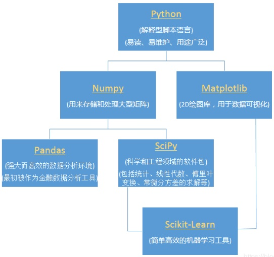

# python科学计算库简介

Python语言之所以如此风靡，一个重要原因是基于它有不少良好的科学计算库，常见的几个库有：numpy、pandas、scipy 等。接下来本repo的第二部分就简要地记录下在水文水资源计算中常用到的这些库的功能。

这些库并不是孤立的，所以接下来首先看看这些库之间的关系，为后面的记录提纲挈领。可以参考：[Python numpy，scipy，pandas这些库的区别是什么？](https://www.zhihu.com/question/38353562)，[sklearn库的学习](https://blog.csdn.net/u014248127/article/details/78885180)

首先看一张图。

matplotlib 是绘图库，后面本repo第三部分会介绍；scikit-learn是机器学习库，在后面算法示例部分介绍。除python外的剩下的就是几个常用基础库了。简单总结下：

- numpy：以矩阵为基础的数学计算模块，可用来存储和处理大型矩阵，比 Python 自身的嵌套列表（nested list structure)结构要高效的多 -- N维数组容器
- pandas：基于 NumPy 的一种工具，该工具是为了解决数据分析任务而创建的。Pandas 纳入了大量库和一些标准的数据模型，比如DataFrame的数据结构，提供了高效地操作大型数据集所需的工具 -- 表格容器
- scipy：一个用于数学、科学、工程领域的常用软件包，可以处理插值、积分、优化、图像处理、常微分方程数值解的求解、信号处理等问题 -- 科学计算函数库

另外，xarray也是一个常用的科学计算基础库，它能够方便读取netcdf等格式数据，有强大的处理大数据的能力。

接下来就不定期记录日常对这几个库的使用。
