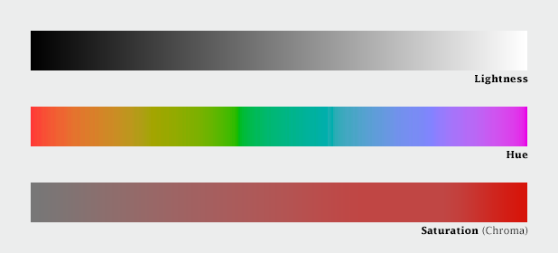
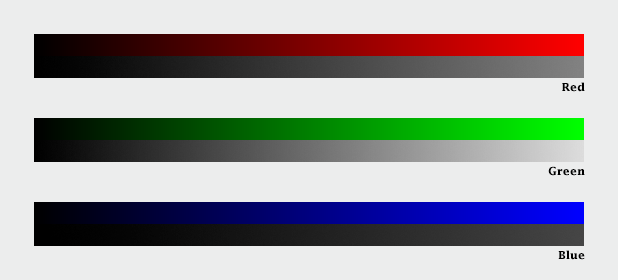
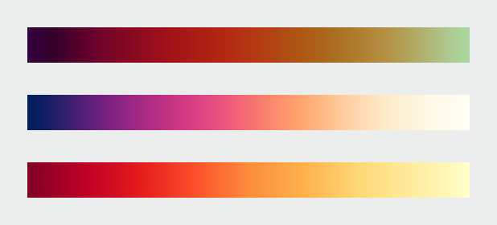

# Elegant Figures 简易翻译

该系列是一个[Rob Simmon的系列blog](https://earthobservatory.nasa.gov/blogs/elegantfigures/2013/08/05/subtleties-of-color-part-1-of-6/)，刊登在NASA earth observatory网站里。一共6篇，本文简单地意译下其主要内容。以便后面自己科研配图中使用。(不定时更新中...)

## Subtleties of Color 

这是系列的第一篇--颜色的微妙。

### Introduction

通常我们在选择颜色时都会打开一个调色板，然后选择一个灰度图或者一个彩虹色，点击apply，就给我们的图上了色。虽然我们知道颜色的选择并不是这么简单，但是我们通常都是这么做的。但是这导致许多可视化并不能很好地表达数据所揭示的内容。

数据可视化的目的是阐释数据，是为了展示隐藏在大量数字背后的数据模式和关系。

在空间数据集中，颜色可能是最有效的精确表达数量的方法，并且是已使用最广泛的。颜色的认真使用可以增强清晰度，帮助讲好故事，并吸引观看者进入到数据中。不好的颜色使用则会阻碍数据表达，甚至错误表达。

幸运地是，有效的，来表示数据的颜色使用的原则是直观的。并且已经由制图工作者发展了超过一个世纪。并由科研工作者进一步地认识，设计和可视化工作的改善了半个世纪。

虽然基础内容比较简单，但是仍有一些复杂的颜色选择，比如：

- 我们看到的光线和我们意识到的颜色之间的关系是十分复杂的
- 有许多不同类型的数据，每一种都适合不同的颜色框架
- 随意的颜色选择会让对数据集不熟悉的观众迷惑
- 暗场中的浅色与亮场中的深色在视觉上是不同的，这可能会使目标检测等一些可视化任务变得复杂

### (Very) Basic Color Theory

虽然肉眼观色是通过视网膜来检测RGB光线，但是我们却并不会以RGB方式思考颜色，而是以亮度（黑白），色度（红橙黄绿蓝靛紫）和饱和度（暗到亮）。这三个变量是基于人类认知的颜色系统的基石。印刷工和画家使用其他颜色系统来描述墨水和颜料的混合。

然而计算机却是以RGB的方式处理颜色的。并且不是人眼观测意义上的红绿蓝。计算机屏幕显示的颜色是一个很窄频率波段内的颜色的组合，而我们眼睛视网膜内的每个锥体是能检测到一个相对较宽的频谱的。更复杂的是计算机是线性计算光线的，而我们人类是对低光度比对高光度的变化更敏感的，且对绿色光比对红色光更敏感，对蓝光更不敏感。

比如上图三原色，我们是觉得绿色更亮的。因此，人类观察和计算机表达并不完全一致。

在我们的视觉中这些非线性的综合结果就是颜色感知是有些笨的。比如我们对一个颜色的饱和度范围的辨识能力是高度依赖于它的亮度的。换句话说，没有暗黄这种颜色的，即太暗了之后就辨别不出是黄色了。比如下图（最左边的hue小图和下方的lightness箭头以及中间图的saturation是三个坐标，该图片共三个图）。在亮度范围的中心附近，蓝色和红色渐变是可以非常饱和，但绿色色调不能（即我们观察绿色饱和度变化不明显）。此外，非常亮和非常暗的颜色总是不饱和的。

### CIE Color Spaces

颜色感知的不均匀性是由国际照明委员会上世纪30年代绘制的（国际照明委员会法语简称CIE）。CIE制定了一系列颜色空间来让科学家，艺术家和印刷师等来一致性地描述颜色，并能精准地在不同媒介之间转换。比如Adobe的Photoshop内部就使用CIE L\*a\*b来插值颜色梯度和转换RGB图（屏幕）为CMYK（打印）。

另一个标准CIE L\*C\*h \[lightness, chroma (saturation), hue\]是作者常用的颜色板。因为简单易用。它是基于人类视觉认知的。L\*C\*h下开发的颜色范围是能帮助我们准确表达数据的内涵的。

总之，人不是计算机。计算机颜色是线性和系统的，人的颜色感知是非线性不平衡的。许多工具是根据计算机设计的，而不是针对人的，包括以RGB或者HSV来指定或计算颜色的工具。恒定增强的亮度人看了是不会认为是线性的的，人对对红色、绿色和蓝色的响应也是不同的。找一些工具和调色板来描述感知色彩空间中的颜色，比如CIE L\*C\*h 或Munsell。

## The “Perfect” Palette

尽管几乎无处不在的彩虹调色板扭曲了底层数据的模式，但使用颜色表示数据的基础还是很好的建立的。

到20世纪60年代中期，制图者已经建立了在制图过程中合理使用颜色的指导原则。Jacques Bertin指出彩虹颜色板的缺点，Eduard Imhof  使用了制作了协调的颜色变化梯度在制图中使用。

20世纪八九十年代，感知和视觉研究者基于我们大脑和眼睛对光的物理感知调查了颜色板的效力。这些颜色比例的设计是为了实现空间显示的主要目标:显示数据中的模式和关系，并允许看图者准确地读取各个值。

根据研究主要内容，一个颜色刻度应该在全值域范围内变化一致，这样每一步都是相等的，而不管它在刻度上的位置如何。即1和2之间的差别和11和12之间的差别是一样的，这样能保持数据的模式和关系。对于较广泛的值范围，对数差相等更好。数字之间的一致关系，比如灰度调色板，就保持了数据的组成。带有突变或不均匀变化的调色板可以在某些区域夸大对比，并隐藏其他区域。

调色板还应尽量减少由附近不同颜色或亮度区域引起的颜色变化，这种现象称为simultaneous contrast. 如下图所示，四个小方块的颜色是一样的，但是视觉上看因为背景不一样，同时看的时候反而觉得颜色不一样了。

simultaneous contrast 在单色调色板中最明显，而色相的急剧变化使这种效果最小化。因此，彩虹调色板的变化有利于保存准确量。

那么如何利用灰度调色板(保留形式)和彩虹调色板(保留数量)的优点，同时最小化它们的缺点?

将亮度的线性、比例变化与色相和饱和度的同时变化结合起来。科林·威尔(Colin Ware)将这种调色板描述为一种螺旋形的色彩空间，在各种色调之间循环，同时不断增加明度。**亮度的连续、平滑的增加**保存了模式，**色调的变化**帮助精确量的读取，而**饱和度的变化**增强了对比度。比如下列调色板：

在色彩的色相、饱和度和亮度三要素中，亮度是最强的。因此，**亮度的精确、单向变化比色相或饱和度的变化更重要**。例如，从黑色到彩色再到白色的颜色刻度仍然可以被准确读取，即使刻度两端的饱和度低于中间。这在设计调色板时提供了一些灵活性，特别是对于从高对比度渐变中获益的数据集。对于ramp的一部分，您也不需要太担心颜色范围会偏离色域(在特定设备上显示的颜色的完整范围)。只要确保亮度仍然平稳地变化。

所有这些调色板都适用于**顺序数据**。从高到低连续变化的数据;例如温度、海拔或收入。**不同的调色板适用于其他类型的数据**，如发散性和定性，下节讨论。

## Different Data, Different Colors
