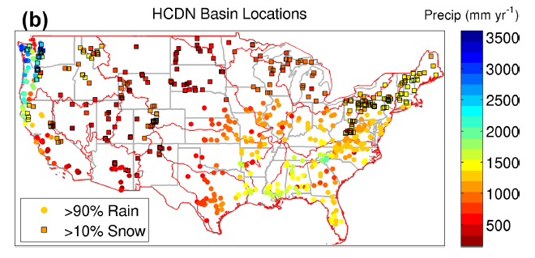
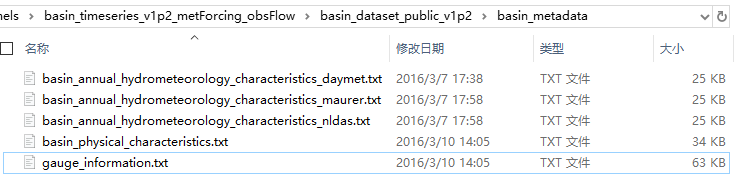
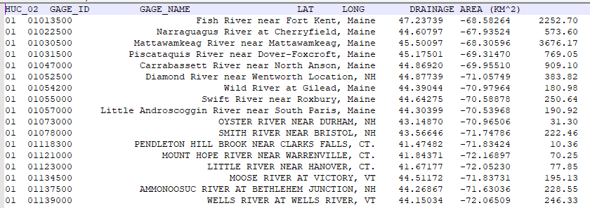
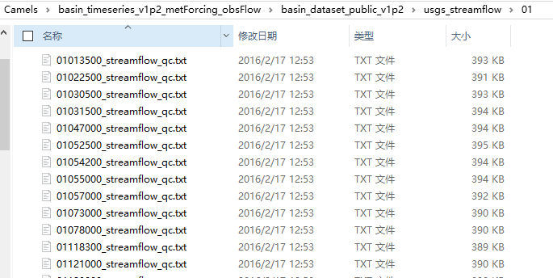
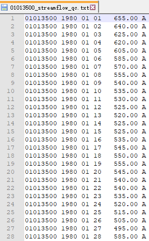
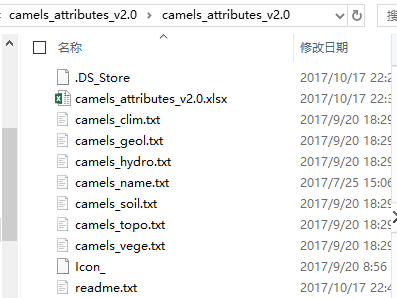

# CAMELS

CAMELS数据[官网](https://ral.ucar.edu/solutions/products/camels)推荐了两篇HESS的文献，这两篇文章详细介绍了CAMELS数据。这里简要整理一下两篇文献主要内容。

## 背景

制作CAMELS数据最开始的目的在于提供一个模型性能的benchmark。

随着数据的增多和计算能力的增强，基于大样本数据开展水文研究越发常见，这里面也诞生了一批水文气象数据集。比如，MOPEX（Model Parameter Estimation Project）数据集可以提供CONUS上438个流域的观测径流和一些水文气象数据。

目前，local的model很多（有depth），因为针对各个流域可以率定符合自己流域特性的模型结构或参数，但是却少有general的model（有breadth的）。为实现general model，有必要整理水文气象大数据集和建模工具来帮助理解水文模型性能的区域变化。

## N15数据集

CAMELS数据集的前期版本是2015年那篇HESS上的文献介绍的，简称其为N15数据集。

该数据集来自多个美国机构和研究实验室，能提供高质量高保真的数据。包括：

- 671个流域1980-2010年的多空间尺度的日驱动数据
- 日径流数据
- 基础元数据：位置、高程、大小、流域分界的shapefile等
- benchmark model performance：包括最后率定的模型参数集和各流域模型输出时间序列和相关图像。

关于模型部分，模型采用的是耦合Snow-17和SAC-SMA（Sacramento Soil Moisture Accounting）的水文模型。

因为这里重点关注的是数据集的性能，因此模型的benchmark待后续有接触的时候再补充，这里只对数据集展开说明。

接下来，介绍该数据集的构建思路及各个类型数据的来源和计算方式。

### 流域基础数据

USGS-II数据集包括有超过9000个站点的地理空间信息。其中有一部分reference gages（详情可参考GAGES文件夹下的文档）代表了一部分minimal human disturbance的站点。在这一部分内，有一些作为HCDN（Hydro-Climate Data Network）数据集的后续版，称为HCDN-2009（这部分可参考GAGES文件夹下的[HDCN.md](https://github.com/OuyangWenyu/hydrus/blob/master/6-research-data/GAGES/HCDN.md)）。

这部分数据集满足一下标准：

- 至少20年数据
- 是GAGES-II的reference gages
- 根据NLCD（National Land Cover Database）-2011数据，有少于5%的imperviousness
- 通过了local水科学中心评价的人类活动影响调查

最终得到了671个流域。分布如下图所示。

这671个流域覆盖全美，有很广泛的水文气候条件。东南温暖湿润的流域、西南炎热干旱的流域、西北凉爽湿润的流域和东北干燥寒冷的流域都包含在内。

在从NCAR官网下载的CAMELS数据文件夹中，流域基本元数据在basin_timeseries_v1p2_metForcing_obsFlow\basin_dataset_public_v1p2\basin_metadata文件夹中。文件夹内容如下图所示。

其中，站点信息主要在gauge_information中，详细数据如下图所示。

### 驱动数据

因为水文模型有不同尺度空间信息作为输入，包括流域级entire watershed（lumped）、elevation bands、水文相应单元hydrologic response units（HRUs）或者grids。所以驱动数据也相应的计算到不同尺度上。

流域空间配置根据MoWS（USGS Modeling of Watershed Systems）group的水文模型的geospatial fabric建立。geospatial fabric介绍见[geospatial-fabric.md](https://github.com/OuyangWenyu/hydrus/blob/master/6-research-data/CAMELS/geospatial-fabric.md)；

DEM数据作用于geospatial fabric数据上以创建每个流域的高程轮廓shape文件；

用由USGS的Center for Integrated Data Analytics（CIDA）开发的USGS Geo Data Portal（GDP）来生成基于面积权重的forcing数据；

Daymet数据被选为主要的**gridded气象数据集**来推求径流模拟所需的forcing数据。Daymet数据是日尺度的1km*1km网格的覆盖全美大陆数据集。包括七个地表参数：

- minimum temperature
- maximum temperature
- precipitation
- shortwave radiation
- vapor pressure
- snow water equivalent
- day length

数据集涵盖了从1980年1月1日到最近的完整日历年的12月31日。随后的每个年份在日历年度结束时单独处理。Daymet变量是连续地表变量，以单个文件的形式提供，以变量和年份为单位，有1 km x 1 km的空间分辨率和每日时间分辨率。数据采用北美地区的Lambert保角圆锥投影格式，并以符合气候与预报(CF)元数据约定(1.6版)的netCDF文件格式分发。

PET数据Daymet没有，所以使用Priestly-Taylor方法进行估算；

文献[A Long-Term Hydrologically Based Dataset of Land Surface Fluxes and States for the Conterminous United States](https://journals.ametsoc.org/doi/full/10.1175/1520-0442%282002%29015%3C3237%3AALTHBD%3E2.0.CO%3B2)（参考对文献的解析[一文](https://github.com/OuyangWenyu/hydrus/blob/master/6-research-data/CAMELS/maurer2002.md)）和National Land Data Assimilation System（NLDAS）（可参考LDAS文件夹下的[说明](https://github.com/OuyangWenyu/hydrus/blob/f27fee49f25d5a445da915c231fda8bd13ac5b1d/6-research-data/LDAS/LDAS.md)）12km网格数据集用来提供**basin lumped尺度的日forcing数据**；

其余关于数据的细节就不再表述了，详情可参考原文，这里给出各个数据集的在计算机中的实例情况。

流域级别的forcing数据在basin_timeseries_v1p2_metForcing_obsFlow\basin_dataset_public_v1p2\basin_mean_forcing文件夹下。
如前所述，有三种驱动数据集，daymet虽然是grid的，但是也有流域尺度上的驱动数据，另外两种就是maurer和NLDAS的驱动数据集。这里选择NLDAS数据集为例展开。

18个分区是geospatial-fabric的分区结果。进入每个分区，文件夹如下图所示。

每个文件内的格式如图所示。即每日12时的7项forcing数据值。

### 径流数据

HCDN-2009 gages的日径流数据是从USGS官网获取的，文件根目录是basin_timeseries_v1p2_metForcing_obsFlow\basin_dataset_public_v1p2\usgs_streamflow，其下共有18个子文件夹，分别对应USGS HUC两位编号1-18，每个文件夹下都有名为“gggggggg_streamflow_qc.txt”的文件，其中gggggggg是USGS径流gauge的8位ID。

每个区域的文件夹下的内容如图所示。

每个文件里的径流数据格式如图所示，每个文件的列名为：GAGEID Year Month Day Streamflow(**cubic feet per second**) QC_flag，共6项。径流值missing的被赋值 -999.0。文件都是日平均径流，QC_flag最后一列有A、A:e、M三类值，A表示实际观测值；A:e表示径流估计值；M表示missing，对应的径流是-999.00。

## CAMELS数据集

CAMELS数据集全称为Catchment Attributes and Meteorology for Large-sample Studies。

相比于前述N15数据集，CAMELS数据集为671个站点主要补充了一些新属性数据集。主要六类属性：

- topography
- climate
- streamflow
- land cover
- soil
- geology

这些新的属性集和N15数据集一起构成了CAMELS数据集。

这部分的介绍从扩充N15数据集的动机及扩充内容，和CAMELS最终数据集构成两大方面展开。

### from N15 to CAMELS

流域属性是landscape的descriptors。为了表达流域的多方面，流域属性要覆盖多方面。

关于流域属性，一个成果比较丰富的方向是探索不同流域属性之间的内在联系。比如气候和地形如何影响植物生产。

流域属性还可以作为量化流域相似性的标准方法。

还有很多用流域属性来反映模型中landscape结构的研究。比如通过流域属性推求模型参数。在PUB问题上实现水文建模。还有的不只是反映到参数上，也有应用到模型结构上的。

现在大样本流域能提供更多的关于流域属性的洞察。研究不同gradients的changes，更好地从流域行为中分离出流域属性的作用。大数据还使得探索流域属性和空间模式之间关系成为可能。

构建CAMELS是为了达到以下目的：

- 使空间数据匹配流域尺度。不同的数据集有不同的空间配置，通过建立流域尺度的属性集可以拿来简化属性之间关系评估；
- 推求气候indices和水文signatures，减少水文气候数据集的维度，同时尽可能保留最多信息，即让气象驱动和径流日时间序列有丰富的信息，有通过信息的总结让流域比较更容易；
- 描述流域的land cover，soil和geology。一个目的是更好的评估数据集能多好地获取landscape关于水量存储和传输的特征
- 明确地理属性的不确定性，基于流域属性的可靠性来帮助流域选择
- 为了保证数据空间一致性，减少仅使用数据集生成模拟区域变化的风险。

#### 数据项

CAMELS的attributes数据在camels_attributes_v2.0文件夹中。下载的压缩包解压后如下图所示，camels_attributes_v2.0\camels_attributes_v2.0。

6个txt文件，camels_topo.txt/camels_clim.txt/camels_hydro.txt/camels_vege.txt/camels_soil.txt/camels_geol.txt分别对应6个主要属性。

一个xlsx文件是对各个txt文件的详细说明，这里把其内容copy并翻译如下列各项所示。

##### Location and topography

| 属性               | 描述                            | 单位              | 数据源            |
| ------------------ | ------------------------------- | ----------------- | ----------------- |
| gauge_id           | 8位USGS HU编码                  | -                 | USGS data         |
| huc_02             | 2位USGS HU编码                  | -                 | USGS data         |
| gauge_name         | gauge名+state                   |                   | USGS data         |
| gauge_lat          | 纬度                            | $^\circ$N         | USGS data         |
| gauge_lon          | 经度                            | $^\circ$E         | USGS data         |
| elev_mean          | 流域平均高程                    | m above sea level | USGS data         |
| slope_mean         | 流域平均坡度                    | m km$^{-1}$       | USGS data         |
| area_gages2        | GAGESII计算的流域面积           | km$^2$            | USGS data         |
| area_geospa_fabric | geospatial fabric估算的流域面积 | km$^2$            | geospatial fabric |

每个catchment都有以上各类属性。
使用geospatial fabric数据集和GAGES-II数据集计算的流域面积有差别。geospatial fabric数据集主要focus continental-scale的水文建模，因此有些差异是在geospatial fabric数据集开发的时候就存在了。所以如果与GAGES-II差别较大，最好不要使用。使用GAGES-II的数据。

##### Climate indices

| 属性             | 描述                                | 单位           | 数据源 |
| ---------------- | ----------------------------------- | -------------- | ------ |
| p_mean           | 日均降水                            | mm day$^{-1}$  | Daymet |
| pet_mean         | 日均PET                             | mm day$^{-1}$  | Daymet |
| aridity          | PET/P 日均PET与日均降雨比值         | -              | Daymet |
| p_seasonality    | 降水的seasonality和timing           | -              | Daymet |
| frac_snow        | 降水中雪的形式的比例                | -              | Daymet |
| high_prec_freq   | 5倍以上日均降水的降水天数的频率     | days yr$^{-1}$ | Daymet |
| high_prec_dur    | 5倍以上日均降水的降水的平均持续时间 | days           | Daymet |
| high_prec_timing | 5倍以上日均降水的降水发生的季节     | season         | Daymet |
| low_prec_freq    | 降雨小于1mm/day的dry days的频率     | days yr$^{-1}$ | Daymet |
| low_prec_dur     | dry days的平均持续时间              | days           | Daymet |
| low_prec_timing  | 大多数dry days发生的季节            | season         | Daymet |

Climate indices使用N15的Daymet气象驱动数据推求的。所有climate indices和下面的hydrological signatures计算的时期都是从1989.10.01到2009.09.30，即水文年1990年到2009年。因为之前有的部分有数据缺失。并且这部分数据腿与推求climatological indices是足够长的了。

indices很多，选择上表中所示这些足够支持对水文过程的研究了。这些指标在两个timescale上，一个是daily，一个是seasonal。在seasonal尺度上，计算了是哪个indices：aridity, the fraction of the precipitation falling as snow, 和the seasonality and timing of precipitation.
这三个指标很好地指示了平均的气候条件，但是不能考虑极端事件，所以再加上high和low的indices。

对p_seasonality的补充说明：
参考文献[Analytical model of seasonal climate impacts on snow hydrology:
Continuous snowpacks](https://www.sciencedirect.com/science/article/abs/pii/S030917080900102X?via%3Dihub)

Suppose that, at a point, the typical seasonal variability of precipitation
and air temperature can be modeled as sine curves.

##### Hydrological signatures

| 属性           | 描述                                                                | 单位           | 数据源    |
| -------------- | ------------------------------------------------------------------- | -------------- | --------- |
| q_mean         | 日均径流                                                            | mm day$^{-1}$  | USGS data |
| runoff_ratio   | 径流比例，日均径流与日均降水比值                                    | -              | USGS data |
| stream_elas    | 径流降水弹性                                                        | -              | USGS data |
| slope_fdc      | 径流duration curve的斜率（between log形式的33rd和66th径流百分位数） | -              | USGS data |
| baseflow_index | 基流指数，日均基流与日均径流之比                                    | -              | USGS data |
| hfd_mean       | 自10月1日起的累积径流量为年径流量一半的日期                         | day of year    | USGS data |
| Q5             | 5% flow quantile（low flow）                                        | mm day$^{-1}$  | USGS data |
| Q95            | 95% flow quantile（high flow）                                      | mm day$^{-1}$  | USGS data |
| high_q_freq    | high-flow（大于9倍的日径流中值）日子的频率                          | days yr$^{-1}$ | USGS data |
| high_q_dur     | high-flow（大于9倍的日径流中值）事件的平均duration                  | days           | USGS data |
| low_q_freq     | low-flow（小于0.2倍的日径流中值）日子的频率                         | days yr$^{-1}$ | USGS data |
| low_q_dur      | high-flow（小于0.2倍的日径流中值）事件的平均duration                | days           | USGS data |
| zero_q_freq    | Q=0的日子的频率                                                     | %              | USGS data |

水文signatures的选择和climate indices类似，也是选择能capture baseline和low、high flows的。所有signatures都由径流计算得来。

补充说明stream_elas：径流对降雨变化的气候变化相关，在这里通过计算年降雨和径流之间的弹性来表示。

##### Land cover characteristics

| 属性                | 描述                                 | 单位 | 数据源    |
| ------------------- | ------------------------------------ | ---- | --------- |
| forest_frac         | 森林比例                             | -    | USGS data |
| lai_max             | 月均最大叶面积指数                   | -    | MODIS     |
| lai_diff            | 月均最大最小叶面积指数的差           | -    | MODIS     |
| gvf_max             | 绿色植被比例月均值最大值             | -    | MODIS     |
| gvf_diff            | 绿色植被比例月均值最大值与最小值的差 | -    | MODIS     |
| dom_land_cover      | 主要land cover                       | -    | MODIS     |
| dom_land_cover_frac | 主要土地覆盖有关的流域面积的比例     | -    | MODIS     |
| root_depth_XX       | root depth                           | m    | MODIS     |

GVF和LAI是植被密度的两个关键指标，分别估计了植被的垂直和水平方面密度。从Moderate Resolution Imaging Spectroradiometer（MODIS）数据推求的1km land cover产品来估计这些指标的月尺度值。

此外，基于MODIS数据推求得到的International Geosphere-Biosphere Programme(IGBP)分类，可以得到land cover分类相关的指标数据。

最后基于每个格点的IGBP分类，估计了root_depth分布。该分布用一个两参数方程进行估计。随着土壤深度的增加，root比例指数减少，即占根系统50%的土壤层深度对应在0.12m到0.26m范围内的某一深度，占99%的基本对应在1.4到2.4m之间。这两个深度通常称为rooting depth。

关于为什么要考虑root depth，可参考文献[Global Vegetation Root Distribution for Land Modeling](https://doi.org/10.1175/1525-7541(2001)002<0525:GVRDFL>2.0.CO;2).

Vegetation roots are the primary pathway for water
and nutrient uptake by plants and play an important role in terrestrial carbon cycling (e.g., Nepstad et al. 1994; Jackson et al. 1997; Dickinson et al. 1998). Most climate models have emphasized the role of roots in water up- take by implicitly or explicitly including roots (includ- ing the rooting zone) as one ofthe factors that determine the water holding capacity of the land surface.

##### Soil characteristics

| 属性                 | 描述                                         | 单位        | 数据源                           |
| -------------------- | -------------------------------------------- | ----------- | -------------------------------- |
| soil_depth_pelletier | 到基岩的深度（最大50m）                      | m           | Pelletier(2016)                  |
| soil_depth_statsgo   | 土壤深度（最大1.5m）,水层和基岩层之外的层    | m           | Miller and White (1998)– STATSGO |
| soil_porosity        | 体积孔隙率                                   | -           | Miller and White (1998)– STATSGO |
| soil_conductivity    | 饱和水力传导度                               | cm h$^{-1}$ | Miller and White (1998)– STATSGO |
| max_water_content    | 最大含水量                                   | m           | Miller and White (1998)– STATSGO |
| sand_frac            | 沙的比例                                     | %           | Miller and White (1998)– STATSGO |
| silt_frac            | 淤泥的比例                                   | %           | Miller and White (1998)– STATSGO |
| clay_frac            | 黏土的比例                                   | %           | Miller and White (1998)– STATSGO |
| water_frac           | 水在最上层1.5m里的比例                       | %           | Miller and White (1998)– STATSGO |
| organic_frac         | organic material在soil_depth_statsgo中的比例 | %           | Miller and White (1998)– STATSGO |
| other_frac           | 其他部分在soil_depth_statsgo中的比例         | %           | Miller and White (1998)– STATSGO |

土壤特性主要基于State Soil Geographic Database(STATSGO)数据集推求。文献[Miller and White (1998)](https://doi.org/10.1175/1087-3562(1998)002<0001:ACUSMS>2.3.CO;2)将top2.5m的土壤离散划分成了11层，厚度随着深度增加而增大。每层根据STATSGO数据确定主要的soil texture类型。考虑了16类，12个美国农业部（USDA）的soil texture类型和4个non-soil类型——organic material/water/bedrock/other。

通过多元回归，根据sand和clay比例，推求每层的饱和水力传导度和体积孔隙率。

关于Miller and White (1998)文献：
create map coverages of soil properties including soil texture and rock fragment classes, depth-to-bedrock, bulk density, porosity, rock fragment volume, particle-size (sand, silt, and clay) fractions, available water capacity, and hydrologic soil group.

##### Geological characteristics

| 属性                | 描述                               | 单位 | 数据源  |
| ------------------- | ---------------------------------- | ---- | ------- |
| geol_class_1st      | 流域最常见的地质类型               | -    | GLiM    |
| geol_class_1st_frac | 最常见地质类型流域面积的比例       | -    | GLiM    |
| geol_class_2nd      | 流域第二常见的地质类型             | -    | GLiM    |
| geol_class_2nd_frac | 第二常见地质类型流域面积的比例     | -    | GLiM    |
| carb_rocks_frac     | 被当做碳基沉积岩石的流域面积的比例 | -    | GLiM    |
| geol_porosity       | 地下孔隙率                         | -    | GLHYMPS |
| geol_permeability   | 地下渗透率（log10）                | -    | GLHYMPS |

对于地质属性，使用了两个互补数据集Global Lithological Map（GLiM）和Global Hydrogeology Maps(GLHYMPS)。

GliM数据集从92个地区maps中合成的lithological data。空间分辨率是很好的。有三级，这里选择了第一级。区分了16个类别。再依据这些数据在格点上去计算上表中的数据。

carbonate sedimentary rocks类主要是和水文相关，所以单独记录。

GLHYMPS数据是基于GLiM空间多边形的，因此其分辨率是相当高的。Gleeson et
al. (2014) 主要依赖GLiM lithologic classes来量化推求the geologic units below soil horizons的两个关键指标: porosity and permeability。CAMELS使用这两个指标的流域平均值。

## CAMELS数据集与GAGES-II数据集

这部分比较两组数据集，看看互相之间有哪些数据是没有的。

首先从USGS来的数据肯定是CAMELS和GAGES-II共有的，这部分就不表述了。关于不同的部分，以CAMELS为主体，看看GAGES-II缺少哪些对应项。

### Forcing Data

CAMELS的驱动数据grid的主要来自Daymet，流域级的主要是Maurer2002的数据和NLDAS。我们用NLDAS-2数据集。

### Climate

| 变量类型         | CAMELS | GAGES-II | 如何补充   |
| ---------------- | ------ | -------- | ---------- |
| p_mean           | √      | ×        | 没有日尺度 |
| pet_mean         | √      | ×        | 没有日尺度 |
| aridity          | √      | ×        | 没有日尺度 |
| p_seasonality    | √      | ×        | 没有日尺度 |
| frac_snow        | √      | ×        | 没有日尺度 |
| high_prec_freq   | √      | ×        | 没有日尺度 |
| high_prec_dur    | √      | ×        | 没有日尺度 |
| high_prec_timing | √      | ×        | 没有日尺度 |
| low_prec_freq    | √      | ×        | 没有日尺度 |
| low_prec_dur     | √      | ×        | 没有日尺度 |
| low_prec_timing  | √      | ×        | 没有日尺度 |

### Land Cover

| 变量类型            | CAMELS | GAGES-II | 如何补充   |
| ------------------- | ------ | -------- | ---------- |
| forest_frac         | √      | √        | 数据源一致 |
| lai_max             | √      | ×        |            |
| lai_diff            | √      | ×        |            |
| gvf_max             | √      | ×        |            |
| gvf_diff            | √      | ×        |            |
| dom_land_cover      | √      | ×        |            |
| dom_land_cover_frac | √      | ×        |            |
| root_depth_XX       | √      | ×        |            |

### Soil

Soil数据都是以STATSGO为基础的，不过具体的属性还需进一步确认。

### Geological

这部分数据源不一样，因此结果可能是不一致的。
