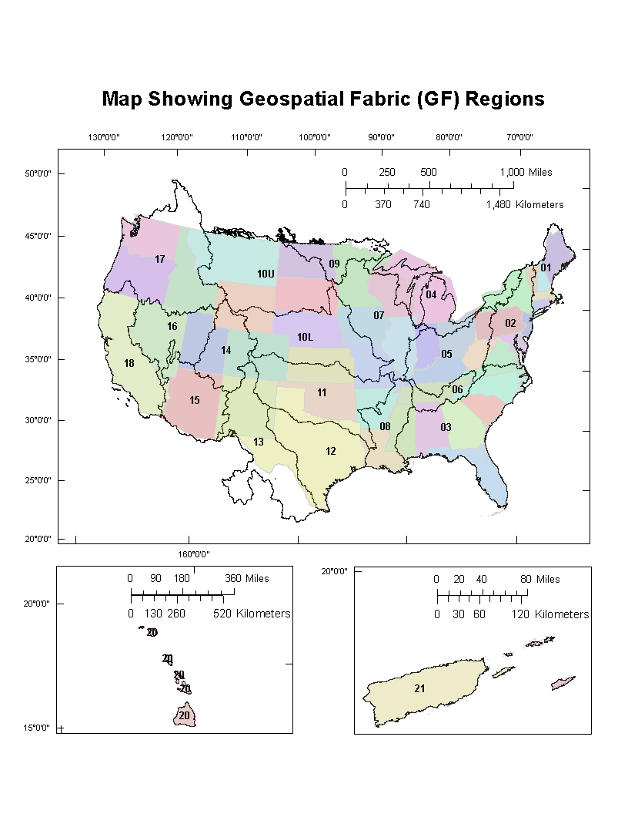

# Geospatial Fabric

Geospatial Fabric是一个数据集。第一个发布的版本包括两个单独的文件。一个是针对the GIS feature geometry；另一个是the set of attribute tables from which PRMS（Precipitation Runoff Modeling System） parameter files are generated。

两个产品都在[National Hydrologic Modeling Framework](https://www.sciencebase.gov/catalog/folder/4f4e4773e4b07f02db47e234) 社区网站中发布。

数据集有一个完整的FGDC-compliant元数据。数据集是ESRI文件geodatabases格式，根据Geospatial Fabric Regions（如下图所示,geo fabric regions更像是一个纯粹的地理拼图）进行组织。

Geospatial Fabric提供了一个consistent, documented, and topologically connected set of spatial features，为水文建模创建了一个abstracted stream/basin network of features.

Geospatial Fabric (GF) data set中包含的GIS向量涵盖全美。Four GIS feature classes are provided for each Region:

- the Region outline ("one")
- Points of Interest ("POIs")
- a routing network ("nsegment")
- Hydrologic Response Units ("nhru")

Geospatial Fabric Regions和用来组织NHDPlus v.1 dataset (US EPA and US Geological Survey, 2005)的区域是一样的。不过Geospatial Fabric Regions仍然是一个全新的数据集，已经被用来广泛支持regional and national scale的水文模型应用了。

总之Geospatial Fabric数据集是国家水文数据National Hydrography Data set流域分析用的。国家水文数据包含了USGS的径流测站点，水文相应单元边界和径流分割，而geospatial fabric则包含了其中的需要的站点及其上游流域面积和流域HRUs。
