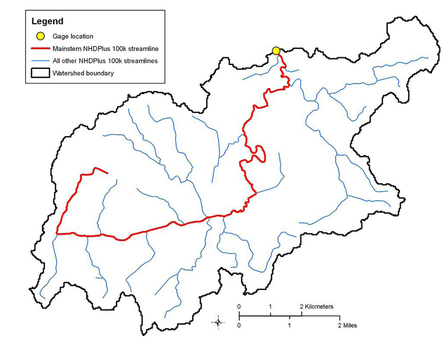

# GAGES数据集概览

GAGES全称为Geospatial Attributes of Gages for Evaluating Streamflow，是一个径流测量数据库，用以评估美国大陆自然和人工改变下的径流条件。GAGES现在已经有了第二版，这里首先根据GAGES官方说明文档，看看GAGES都有什么数据，然后再根据GAGESII对GAGES的扩展说明详解GAGESII。

## GAGES数据集

主要内容是结合GAGES数据集对Ecological Archives E091-045-D1文档，即GAGES数据集说明文档进行翻译理解。

### METADATA CLASS I. DATA SET DESCRIPTORS

首先是元数据的描述。

[gages_basinchar_sep3_09.zip](http://esapubs.org/Archive/ecol/E091/045/gages_basinchar_sept3_09.zip)：该文件包括了25个使用制表符分隔号制作的txt文件，代表了流域的watershed和站点sites的特性。每个txt文件包括变量描述，每个excel文件表示了hydrologic disturbance index score calculation。这25个文件每一个都包含6785条记录，每个代表一个stream gage，由唯一的GAGE_ID标识符进行标识。

对变量的描述都在gages_basinchar_sep3_09.txt中，它包含375条记录，每一条对应一个变量。
变量类型包括：

- BasinID：指流域的一些基本属性，包括有GAGE_ID, Name, DRN_SQKM 流域面积单位平方公里, HUC , LATITUDE, LONGITUDE等；
- Bas_Classif：流域的一些额外属性，比如是否是reference的（reference的含义参考文献），再比如HYDRO_DISTURB_INDEX是基于7个变量综合计算得到的hydrologic disturbance index 分数；
- Bas_Morph:BAS_COMPACTNESS=流域的面积与周长平方比，越大的数表示流域越compact；
- Census_Block:表示流域内人口密度，基于block数据的普查；
- Census_County:表示流域内人口密度，基于county数据的普查
- Climate:关于气候的统计性质的属性，比如PPTAVG_SITE表示流域平均年降雨，还有关于气温、湿度、蒸发等各个时间尺度、维度的统计属性；
- Geology:主要是流域最主要地形的描述；
- Hydro:水文属性或统计相关的数据，比如河流分级最大级数，基流系数等属性，比如各月平均径流等统计属性；
- HydroMod_Dams:流域Dam的一些统计数据，包括Dam数，Dam密度，Dam蓄水量等；
- HydroMod_Other:其他类型的人工影响的数据，包括渠道等的统计数据；
- Infrastructure:道路密度和不透水面积比例；
- LandScape_Pat:流域内未被人类开发的土地的占比系数
- LC01_Basin:流域内各个土地利用类型的比例，包括城市、森林、农业、水域等等；
- LC_Change92_01:这类数据反映92年到01年间的土地利用的变化情况；
- LC01_Mains100:河流中心主干线左右100m缓冲区的土地利用情况；
- LC01_Mains800:河流中心主干线左右800m缓冲区的土地利用情况；
- LC01_Rip100:河流边缘100m缓冲区的土地利用情况；
- LC01_Rip800:河流边缘800m缓冲区的土地利用情况；
- Nutrient_App:化肥和动物粪便得到的氮和磷等的估计量；
- Pest_App:农药的估计量；
- Prot_Areas:流域保护区的比例；
- Reach:河道的编码；
- Regions:gage站点所在位置所属的各类划分方式得到的region，比如ecoregion，HUC 8等；
- Soils:各类型土地的土壤情况及各类统计数据；
- Topo:流域高程、坡度等地形数据。

disturb_index6785_sept3_09.xls文件提供了disturbance index scores是如何得到的。在results部分显示了每个站点的score都是七项数据的总和；
在notes部分，说明了如何计算的。
七项数据分别是：

- FRESHW_WITHDRAWAL表示每年每平方公里被取走的淡水量；
- MAJ_DDENS_2006指每100平方公里上的dam数；
- 2006_STOR - pre1950_STOR指50年到06年水库蓄水量的变化；
- sum_percent_canals_artif是人工河流的比例；
- DIS_ADJ_NEAREST_MAJ_NPDES中，NPDES表示National Pollutant Discharge Elimination System，所以该项意思是到最近的NPDES站点的距离，数字越大表示越有可能干扰；
- ROADS_KM_SQ_KM指道路密度；
- FRAGUN_BASIN from NLCD01代表未开发区域的比重。

剩余的25个文件则分别对应gages_basinchar_sep3_09.txt中描述的25个类型，详细介绍每个站点的这25类数据情况。

接下来对这些数据再分别展开叙述。

### CLASS II. RESERACH ORIGIN DESCRIPTORS

数据集的时间范围是1950-2007年。
研究GAGES数据集的主要目的是划分流域并且编辑全美的站点GIS信息。其次想要找出哪些站点是受人类影响活动较显著的。特别地，想要通过GAGES的工作找出哪些是受人类活动影响小的站点。
为此，整合了这么样的一个大数据集，描述流域自然和人为的条件及特征。介绍GAGES的这个报告的目的是描述这样一个数据集的收集方法，并提供获取数据的链接。

研究方法：

#### Gage screening and watershed boundary delineation

筛选数据。包括时间上，要有足够长；其次，流域边界要在美国境内；然后人造河流上的测点也都排除了；超大流域上的站点也排除了；最后是要能准确地划分出流域边界。

#### Calculation of watershed characteristics

使用NHDPlus 100k 尺度径流数据集来描述径流。变量包括：环境的（气候、土壤、地理、水文、地形），landscape（土地利用、ecoregions），人类活动影响特性的（基础设施、人口、当前和历史上存在的大坝、渠道、污染径流站）。gages_variable_desc_sept3_09.txt文件中都已提供详细的元数据来说明了。

定义了mainstem streamline：从NHDPlus河流数据集中可以确定的距离流量计上游很远的主要排水渠道。也就是从一个站点开始，向上游追溯，直到在源头无法确定哪一个是主干，如图所示。

在5中空间尺度上，计算土地利用类型包括整个流域，以及河道中心100及800米缓冲区，和河道边缘100-800m缓冲区。

#### Identification of reference stream gages

水文上讲reference conditions可能指代的是“least disturbed”，也可能是“best attainable”。
有很多影响河流flow regime的人类活动，包括dam，diversions，urbanization和drainage modifications，提和渠化，地下水抽水泵，以及森林退化。
有些地方，这些因素已经形成永久性影响，几乎所有河段都是disturbed；而在另一些区域，还存着undisturbed流域。
有几种关于reference condition的变种：minimally disturbed，historical，least disturbed和best attainable条件。这里将reference规定为least-disturbed condition。

使用三种方法来识别reference质量的径流测站。

1. hydrologic disturbance index。
